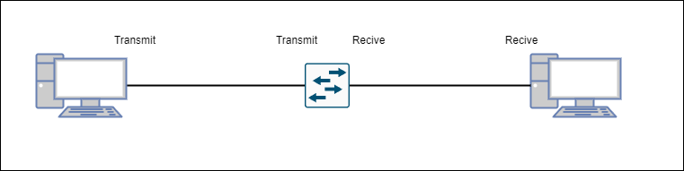
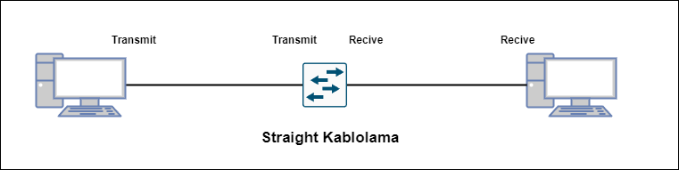
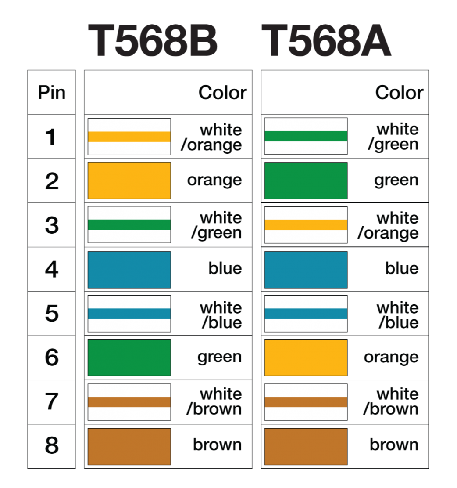
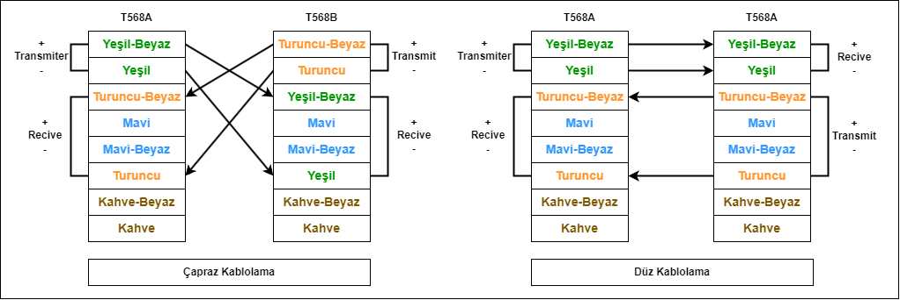
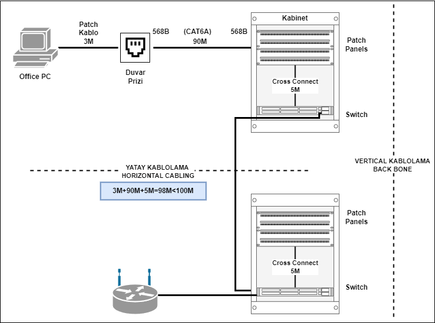
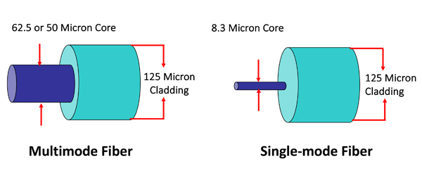
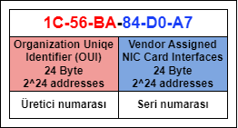
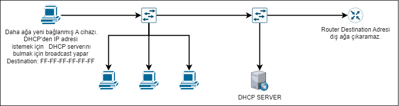
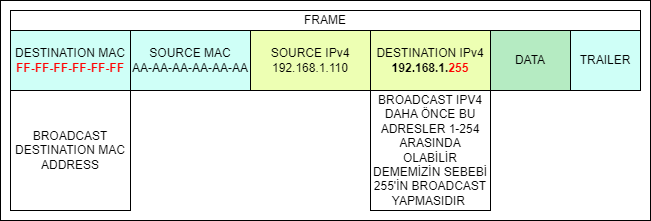
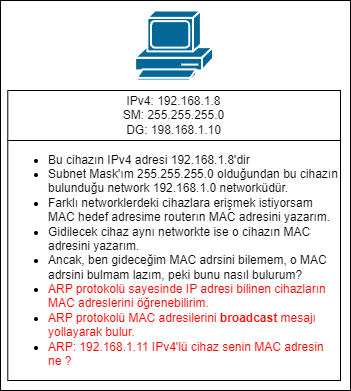

## 1-GEÇMİŞTEN GÜNÜMÜZE İNTERNET
|“Fixed” Computing   |Bring Your Own Device   |Internet Of Things   |Internet Of Everything   |
|---|---|---|---|
|Eskiden cihazlara kullanıcının fiziksel olarak gitmesi gerekirdi.”Sabit” bilgisayarlar vardı.   |Cihazların kolayca taşınabilir hale gelmesidir. Şirketlerde ve kurumsal ofislerde kişisel cihazların kullanılması trendidir.  **-Güvenlik risklerini artmıştır.**  **-Ağ yöneticilerine yeni yük binmiştir** |Age of devices olarak bilinen teknolojik gelişmedir. Fiziksel objelerin, toplu olarak ve internet yoluyla iletişimini gerçekleştirme teknolojisidir.	   |İnsanların, işlemlerin, verilerin ve cisimlerin gibi birçok  nesnenin dâhil olduğu internet aracılıyla iletişim kurması teknolojisidir.   |

### İnternetin Temel Gelişim Aşamaları
- HTTP (Hypertext-Transport-Protocol) Dönemi: Statik text bazlı sitelerin olduğu dönem olarak tarif edilir.
-  WEB 2.0 Dönemi: Interaktif, dinamik Web sitelerinin yaygın olmasıyla oratya çıkan dönemdir.
-  IoT (Internet of Things) Dönemi: Yalnızca insanlarla değil birbirliyle konuşan cihazların oluşturduğu (Machine-to-Machine, M2M), insan kaynağına gerek duymayan otomasyonla çalışan sistemlerin olacağı dönemdir.

### Local Area Networks-LAN (Yerel Alan Ağları)
-	İki ya da daha fazla cihazın haberleştiği ortama **Network** denir.
##### *Foreshadowing: Aynı tip cihazlar cross-over kablolama ile bağlanır.*
- 	Aynı coğrafyada/bölgede bulunan ağlara **LAN** adı verilir, "Same location" olarak ifade edilir.
### Çeşitli Boyutlu Ağlar:
- SOHO (Small Home Office) ağları
- Şirket ağları
- Global ağlar

***

### Ağ Bileşenleri: Client-Server İlişkisi | Host Kavramı | Intermediary Devices | Network Media

- 	Ağda bulunan bütün son kullanıcı cihazları **host** ya da **end devices** olarak ifade edilir. Pcler, ağa bağlı yazıcılar, VOIP’ler, telefonlar vb. gibi ip üzerinden haberleşme yapan end device'lar **NIC (Network Interface Card)** ile networke bağlanırlar. NIC’in diğer bir adı da **Ethernet Card**’dır.

*NIC cihazların yerel ağa bağlanması sağlayan kartlardır. Neredeyse her host cihazında NIC yani Ethernet kartı bulunur, NIC'ler bazen anakartın içerisine gömülü olarak bulunabilir.*

- **Server** dediğimiz aslında bir host işlemidir. İçerisinde diğer hostların kullanacağı hizmetleri bulundurduğu için bu ismi almıştır. **Client** ise ağ yoluyla serverdan hizmet  **isteyen** cihazlara denir. 

*Server bir cihaz değildir, bir işlemdir. Server işleminin daha hızlı/optimize yapılnası için server bilgisayarları geliştirilmiştir.*

- Cihazların server işlemini yapmak için özel bir server bilgisayarı olma zorunluluğu yoktur, günlük kullanımdaki host/end user cihazları da server işlemlerini kısıtlı kapasitede de olsa yapabilmektedir. Bu duruma **Peer-to-Peer (P2P)** denir. Cihaz P2P sırasında **hem server hem de client** olarak davranır. Torent bağlantılarında kullanılan teknoloji P2P'dır. Ayrıca kripto para benzeri teknolojilerde de P2P'den yararlanılır.

*Ancak Peer-to-Peer sorumluluk almaktır:* *+: Kolaydır, az karmaşıktır, az maliyetlidir ve basit görevler için kullanışlıdır.* *-:Merkezi yönetimi yoktur, güvenli ve ölçeklenebilir değildir ve performans düşüklüğü yaratır.* *Serverların 7/24 açık olması ve cevap verebilir olması beklenir.*

- Switch, Router, Wireless Router, ve Firewall etc. gibi ağ cihazlarına **intermediary devices** (ara cihazlar) denir. Temelinde 2 intermediary cihaz vardır, bunlar router ve switch'tir.

-  **Switch:** Hostları **kablolu** şekilde yerel (local) networke dahil eden cihazdır. Kablosuz cihazlar ise önce **Access Point** adlı cihaza kablosuz şekilde hava aracılığıyla bağlanır, bağlantıdan sonra access point bu bağlantıyı switche kablolu şekilde aktarır.

*Access Point (Kablosuz Erişim Noktası) switch felsefesi ile çalışır.*

- **Router:** Network'ün en temel taşı bu cihazdır. Farklı networkleri birbirine bağlayan cihazdır. Ağdaki mesajların takip etmesi gereken yolu belirler.

*Foreshadowing: BGP protokolü ağ hattında kısa yolu bulmaya yarayan protokoldür.*

NIC'in neredeyse her host cihazında bulunur. NIC intermediary device'lardan router ve firewall'da bulunurken switch'de bulunmaz. Switchler bağlanmak için ethernet kartı kullanır. Yani switchlerin NIC kartı yoktur ancak NIC'ler bağlanmak için swicthleri kullanır.

- **Firewall:** Güvenlik özellikleri arttırılmış router cihazları olarak özetlenebilir.

*Burada bahsettiğimiz device olan Firewall'dır, ağdaki cihazların içersinde bulunan yazılımsal Firewall faklıdır.*

- Ağlarda iletişimin gerçekleştiği ortama **Media** ya da **Network Media** denir. Bazı media tipleri şunlardır: 

*I. **Copper Wire**, elektirik ile veri iletmi yapar, **UTP (Untwisted Shielded Pair)** kablo kullanır.*   *II. **Fiber Optic**, ışıkla veri iletim yapar. Single Mode ve Multi Mode gibi alternatifleri vardır.*   *III. **Wireless İletim**,hava yoluyla iletim yapar. Elektromanyetik dalgalar kullanır.*
***

### **Sınava Özel Notlar:**   
- Kamusal alanda kablo çekmek yasaktır. Yalnızca **ISP (Internet Service Provider)** kablo çekme/ kablolama hakkına sahiptir. ISP'lerin çektiği özel ağlara **leased lines** denir. Leased Lines (private line), kurumların telekominikasyon şirketleri aracılığıyla kiraladığı hususi, özel ağlardır.
-   Router farklı networkleri birbirine bağlar. Yani router'ın farklı interfaceleri farklı ağlara bakar, genelde bir interface ISP'ye diğer intrface ise yerel ağa bağlıdır. 
-   Modem dediğimiz cihazlar temelinde routerdır. Içerisinde access point, switch, router ve DHCP server bulunur.
-  Özel, fiziksel ağa bağlanma portlarına  **Interface** denir.
*Foreshadowing: Port ve Interface birbirinin yerine kullanılan terimlerdir ancak TCP/UDP protokollerindeki portlarla karıştırılmamalıdır.*
-  End device'ları networke bağlayan fiziksel porta **NIC** denir.
-  İki farklı ağı birbirine bağlanmayacaksa router alınmamalıdır.
***
## **Ağ Tipleri:** 

- LAN (Local Area Network): Yerel ağlardır.
- WAN (Wide Area Network): Uzak ağları birbirine bağlamak için kullanılır. LAN'ların ISP kullanılarak bağlanmasıyla WAN oluşur.
- Internet: Temelinde bir WAN'dır. Dünya üzerindeki WAN'ların birleşmesiyle oluşan bir ağdır. 
- Intranet: Kurum içi ağdır. Kurumun bütün içi LAN'lar WAN kullanılarak bağlanmıştır.
- Extranet: Kurum içerisindeki özel ağların diğer kurumların ağlarına bağlanmasıyla oluşturulmuş kısıtlı, kontrollü ağdır.
- MAN (Metropolitan Area Network): LAN'lardan küçük, WAN'lardan büyük. Kentlerde ya da Universitelerde bulunan hatlara verilen genel isimdir.
- WLAN (Wireless LAN).
- SAN (Storage Area Network): Sunucuların, hard disk sunucusu ile olan ağı. Ancak artık günümüzde hard diskler sunucuların içerisinde (Hyperconversion). 

Unutulmamalıdır ki her ağ internete bağı olmak zorunda değildir. Askeri hatlar, devlet kurumlarına bağlı özel ağların internete bağı yoktur.

***

## **Reliable networks:**
### 1 - Fault Tolerance 
- Ağ sistemindeki bazı routerlar ve switchlerin çökmesine rağmen sistemin sorunsuz çalışmaya devam etmesi yüksek "hata tahammüllü" ağ olduğunu gösterir.
- Hata tahammüllü yüksek sistemler. **Redundant**  olarak ifade edilir, kelime anlamı olarak yedek cihazı olan sistemler demektir.

### 2 - Scalability
- Kurulan ağın, gelecekte büyüme işleminde sorun çıkarmayacak şekilde hazırlanması demektir, kelime anlamı olarak büyütülebilirlik denilebilir.

### 3 - Quality of Service (QoS)
- Ağlarda düşük ping olmalıdır.
- Bazı durumlarda bazı cihazlara öncelik verilmelidir.
- Reliable delivery gerçekleştirilmelidir.
- Low latency olmalıdır.

Bu ve benzeri durumlar servis kalitesini belirler.

### 4 - Network Security
Ağ güvenliğinde temel 3 durum korunmalıdır, bunlar:
- Confidentialty: Ağ gizliliğinin korunması.
- Integrity: Ağ bütünlüğünün korunması.
- Availability: Ağa erişilebilirliğin korunması.

***

### **Converged Networks**
Eskiden telefon ve internet ağları ayrıydı. Günümüzde bu ağlar birleşik şekildedir ve bu durum siber güvenlikçilerin işini zorlaştırmaktadır.

***

## **İnternet Erişim Teknolojileri**
- ISP (Internet Sevice Provider): Internet Servis Sağlayıcı olarak çevrilir. 
- **Homeplug**: Bakır (copper) elektrik kablolar kullanan, evdeki priz üzerinden ağ sağlanması teknolojisidir. Kablo kalabalığını engeller. Veriyi evdeki bütün pluglara yollar.
- **WISP** (Wireless Internet Service Provider): **Rural** (kırsal), alanlarda kullanılması daha uygun olan, DSL veya kablo internetin olmadığı yerlerde kullanılan, kablolama gerektirmeyen bir bağlantı teknolojisidir, **802.11 Wireless LAN** standartını kullanır.
- Broadband **Cable**: **TV** hatlarında kullanılan coaxiel TV kablosu ile internet bağlantısının sağlanması teknolojisidir.
- Broadband **Digital Subscriber Line** (DSL): **Telefon** hatlarından aktarılan, elektiriksel yolla iletilen, yüksek hızlı çalışan bağlantı teknolojisi. Bazen "Business DSL" olarak da geçer. Bazı çeşitleri vardır, bunlar:
1 - **Asymmetrical** Digital Subscriber Line (A-DSL): Genelde daha popüler olan, evlerde kullanılan, yükleme hızı indirme hızından çok daha düşük olan cinsteki DSL aboneliğidir.
2 - **Symmetrical** Digital Subscriber Line (S-DSL): Genelde kurumlarda kullanılan hem yüksek indirme hem yüksek yükleme hızına sahip olan DSL aboneliğidir.
- Wireless WANS: Mobile Broadcast olarak da bilinir. 3G, 4G, LTE, 5G gibi teknolojileri içerir.
- Leased Lines (private line): Kurumların, telekominikasyon şirketleri aracılığıyla kiraladığı hususi, özel ağlardır.
- Metro Ethernet: Metropolitan Area Network (MAN) olarak da bilinir.
- Dail Up Telephone: Türkiyede 146 nuamralı hattın aranıp bağlanmasıyla çalışan eski bir telefon teknolojisi.
***
### Kullanıcıları İnternete Bağlanma Sırası:

1- Home User: SOHO, Teleworker
2- DSL: Cable Cellular (Hücresel veri bandı)  Satelitte Dail-Up Telephone (146 hattının aranıp bağlanma)  
3- ISP
4- Internet
### Kurumların İnternete Bağlanma Sırası:
1-Organizasyon
2-Dedicated Leased Lines: Metro Ethnernet, DSL ,Satelitte, IP-MPLS 4G
3-ISP
4-Internet
***
## Yeni Trendler:
- BYOD (Bring Your Own Device): Cihazların, kullanıcının yanında kolayca taşınabilir hale gelmesidir. Şirketlerde ve kurumsal ofislerde kişisel cihazların kullanılması teknolojisidir.
-Güvenlik riskleri artmıştır.
-Ağ yöneticilerine yeni yük binmiştir.
- Collabration: Online iş birliği aplikasyonları ve teknolojilerinin geneli collabration uygulamlarını oluşturur. Toplantıların artık online gerçekleşmesi bu trendin gelişmesinde etkili olmuştur.
- Video İletişim: Video dosya tipler günümüzde networklere yüklenen yüklerin büyük bir kısmını oluşturmaktadır. 
- Cloud Computing: Sunucu kurma ve işletmenin yüksek maliyeti olduğundan kullanıcılar sunucuları kiralama yoluna gitmektedir. (Google Drive, Gmail, AWS, etc...) 

***

## Veri Merkezleri (Data Centers)
- Yüksek hızlı sanal sunucular bulundururlar.
- SAN teknolojisini kullanarak yedekli depolama sağlarlar.
- Elektirik kesintilerine karşı yedek güç kaynakları bulundururlar, veri merkezlerindeki server cihazların 7/24 çalışması beklenir.
- Yedek veri iletişim kanalları bulundururlar, birçok ISP'ye bağlantıları vardır ve redundant bir ağ mimarisi kullanırlar.
- Fiziksel ve yazılımsal kontroller içerirler.
*Data Centerlar bakım yönüyle yüksek maliyetlidir, işletilmesi zordur.*

## Güvenlik Tehditleri
- Spyware: Gizlice veri toplayan malwaredır.
- DoS Attack: Denail of service, yani **availability**nin kesilmesidir.
- DDos: Distirbuted DoS Attack: Compromised bilgisayarlarla gerçekleştirilir.
- Zero Day Attack: İlk kez ortaya çıkmış açığın kullanılarak saldırı gerçekleştirilmesidir. Sürekli yamalama exploitleri engeller. Mavi takım zero day açıklarına çözüm üretir.
- Identity Theft: Başka bir kişi gibi davranarak dolandırıcılık yapılması (**fraud**).

*3 Temel sızma yolu vardır, E-mail, OS exploits, physical devices (USB gibi).*
*Viruslerle mücadele asla bitmez.*
## Security Solutions (Güvenlik Çözümleri)
- Antivirus.
- Firewall.
- IPS: Intrusion Preventation Systems
- VPN: Güvenli bağlantı sağlar.
- ACL: Ağ trafiğinin kontrolünü sağlar. Genelde source ve destination adreslerine bakar. TCP packet header kısmına yada UDP source ve destination portlarına bakar.

## Güvenlikle İlgili Sınav Bilgileri

- **Internal threats are far worse then external threats**. External'da kullanılan hız 2/4/8/10 Mbit hızlarındayken Internal'da bu hız 1000 Mbitlere çıkabilir.
- Firewall dışarıdan gelen birçok tehditi önler. Firewall **cihazı** iç ağda yoktur. Yazılımsal firewall'lar iç ağda bulunurlar.
- **ADSL** routerler NAT yapar. NAT varsa dışarıdan içeriye erişim yapılamaz.
*Statik IP de olsa NAT'a erişilmez.*
*Evdeki akıllı ampüle aynı hatta bağlı cihazla yapılamaz. Sebebi NAT'dır. Cihazdan servera, serverdan da ampüle bağlantı sağlanır. **Doğrudan erişim yoktur**.*

# 3-Protokoller ve Modeller

**TCP/IP**: Günümüzdeki internette kulanılan, 4 katmandan oluşan, protokol kümesidir.
**OSI**: Data haberleşmesinin anlatılması ve açıklanması için tasarlanmış 7 katmandan oluşan modeldir.

## MAC Adresleri ve IPv4 Adresleri
- MAC ve IP, cihazların, aralarındaki iletişimi gerçekleştirmelerinde kullandıkları adreslerdir. Genelleme yapacak olursak MAC adresleri iç ağ haberleşmesinde kullanılırken IP adresleri ağlar arasındaki haberleşmede kullanılmaktadır.

#### **MAC Adresleri:**
- **48 bitten** oluşurlar.
- NIC üzerinde bulunurlar, fiziksel adres olarak da geçerler, eşsizdirler.
- MAC adresleri *9C-35-5B-5F-AA-BB* tazrındadırlar (*0000=0, 0001=1, 0010=2, ..., 1110=E, 1111=F*) (4x2x6=48 bitten oluşmaktadır).
- Ethernet Kartı üzerinde **Bured-in adres**lerdir.
- NIC üzerinde çalışan internet protokolleri cihaz içerisine yüklü gelir ancak istenirse değiştirilebilir, bunlar TCP/IPv4 veya TCP/IPv6'dır.

*Wifi kartı da bir NIC kartıdır.*
#### **IPv4 Adresleri:**
- **32 bit** / 4 kısımdan oluşurlar.
- IP adresleri 192.168.1.5 tazrındadır, alabileceği sayılar (0-255) aralığında olmalıdır, 0 ya da 255 alamazlar. 
- IP adresleri, MAC adreslerindeki kalıcı adreslerin tersine **mantıksal** adreslerdir. "Dynamic addresses" yani dinamik adresler olarak tanımlanırlar.
- IP adresi "192.168.5.1" olan bir cihazın "192.168.5" kısmı "Network" bilgilerini ifade ederken, ".1"  kısmı ise yerel ağdaki "Host" numarasıdır.

### Hatırlatma:
*Router networkleri birbirine bağlayan  ağ cihazıdır, router uçları (interfaceleri) farklı ağlara bakar. Yani bir port 192.168.5 ağına bakıyorsa diğer port 192.168.6 ağına bakar.*

*Switch ise son kullnıcıları ağa dahil eden cihazdır. NIC'leri bulunmaz, bu sebepten MAC'leri de yoktur.*

Bu şekilde **8 adet NIC** ve **7 adet ağ** bulunmaktadır. Bu ağlar:
1- 1.1 & switch
2- 1.2 & switch
3- Switch & 1.3 portlu router 
4- 2.1 portlu router & 2.2 portlu router
5- Switch & 3.3 portlu router
6- 3.1 & switch
7- 3.2 & switch

***

### İletişim Temelleri Oluşturan Temel Unsurları:
- Source (Kaynak).
- Destination (Hedef).
- Media (Ortam).

*Ağlar "scale" ve "complexity" olarak değişebilir, yalnızca bağlantı olması yetmez.*
***
### Mesajların Ağ'daki Hareketi:

*Message Source > Transmitter > Transmission Medium > Reciever > Message Destination*
***
## İletişim Protokolleri:
- Tüm iletişim protokoller çerçevesinde gerçekleşir.
- Protokoller iletişimin izleyeceği kurallardır.
- Kurallar protokollere bağlıdır. Kurallar dizisine ise protokol denir.

5 temel iletişim protokolü vardır, bunlar:

### 1- Encoding:

- Mesajın fiziksel ortamda iletilmesi için uygun hale getirilme işlemidir.
- Encoding işleminin tersi **decoding**'tir, mesajın yorumlanması için çözümlenmesidir.
- Hostlar arası kodlama ortama uygun olmalıdır. Bitler ışık, ses veya elektriksel darbe modeline dönüştürülür, hedef (destination) bunu decoding yardımıyla çözümler.

### 2- Formatting and Encapsulation:

- Bir mesajın gönderilirken belli bir formatta ya da yapıda olması gerekmektedir. Bu format mesajın türüne ve mesaj iletmek için kullanan kaynaklara bağlıdır.

*Data'nın içerisinde version, traffic class, flow control, payload lenght etc. olması bir formatlamdır.*

*Foreshadowing: Encoding fiziksel katmana özgü bir durumken, encapsulation bütün katmanları kapsar.*

### 3- Message Size:

- 500 MB'lık bir dosyayı istersek tek parça halinde gönderebiliriz, ancak iletim sırasında bir sorun sonucu yalnızca bir bit bile yanlış aktarılırsa bütün veri kullanılmaz hale gelir. Bu ölçeklendirilebilir ve kullanışlı değildir. 
- Datayı, küçük parçalar halinde yollamak istersek bu parçaların doğru aktarılması için bir takım kontrol bilgileri gerekmektedir. Adres bilgisi burada devreye girer, bu adres bilgisi verinin kaçıncı dosya olduğunun çözümlenmesinde kullanılır.

### 4- Message Timing:

- Akış kontrolü, iletim hızının yönetiminden sorumludur.
- Connection Timeout, ağdaki cihazların birbirinden yanıt almaması durumunda cihazların ne kadar bekleyecekleri belirler.
- **Flow control** dataların çarpışmaması durumunu İngilizcesiyle **collision** durumunun oluşmasını engeller.
- Collision durumu, ağdaki iletilerin elektiriksel olarak üst üste binmesidir. 

*Foreshadowing: İletim sırasında ağ içerisinde +5V olarak iletilen bitlerin üst üst gelmesiyle collision oluşur.*

### 5- Message Delivery Options:
- **Unicast:** Tek bir kaynak cihazının, tek bir hedef cihazla doğrudan iletişim kurduğu bir mesaj teslimat türüdür. (One-to-One)
- **Multicast:** Bir cihazın birden fazla cihazla yaptığı iletişimdir. Multicast MAC adresiyle çalışır, iletiyle **ilgilenen** cihazlar paketi alır. (One-to-Many)
- **Broadcast:** Bir cihazın ağdaki her cihaza teslimat yapmasıdır. Broadcast IPv4'e özel bir teslimat seçeneğidir. (One-to-All)

*Foreshadowing: Anycast IPv6'ya özel bir teslimat seçeneğidir.*

***

## Ağ Protokollerine Genel Bakış

### 1- Ağ İletişim Protokolleri: 

Ağ İletişim Protokolleri, iki ya da daha fazla cihazın bir veya birden çok ağ üzerinden iletişim kurmasını sağlar, bu protokollerden bazıları şunlardır:

- Ethernet: MAC'lerin kullanıldığı yerel iletişim protokolüdür. 802.3 IEEE protokolü ile temsil edilir.

- IP (Internet Protocol): Global olarak mesajların iletilmesini sağlayan protokoldür. Adresleme işlemini IPv4 ya da IPv6 protokolü tarafından yapılır.

- TCP: Ağda iletilen mesajların güvenli, eksiksiz, akış hızının kontrollü bir şekilde iletilmesini sağlayan protokoldür. Paket sırasını kontrol eder, oluşan hataları tespit eder ve iletiminde sorun çıkan, hatalı paketi göndericiden tekrar ister. TCP **connection oriented** (bağlantı esaslı) bir protokoldür. Bu sebepten dolayı eksiksiz iletim sağlar.

- UDP: UDP, TCP'nin aksine bağlantı gerektirmeyen, kaybolan paketleri geri istemeyen, hata toleransı olmayan, yani kaybolan paketin yok olduğu **connectionless** (bağlantısız) bir iletim protokolüdür. 

- HTTP (Hyper Text Transfer Protocol): Web sayfalarının görüntülenmesinde kullanılan protokoldür. Web sayfalarının içeriğini ve biçimini tanımlar. Web sunucusu ile Web istemcisi arasında iletişimi sağlar. 

### 2- Ağ Güvenlik Protokolleri:

Ağ güvenlik protokolleri kimlik doğrulama (authentication), veri bütünlüğünün korunması (integrity) ve veri şifrelenmesini (data encryption) sağlamak için verileri güvenli hale getirme protokolleridir, bu protokollerden bazıları:

- SSH: Orta adam saldılarının (man-in-the-middle-attack) mümkün olduğu internet ağı üzerinden mesajların güvenli ve şifreli geçmesini sağlayan, bunu da public key kullanarak yapan güvenlik protokolüdür. 
- SSL: TSL'in çıkmasıyla kullanımı azalan, internet güvenlik protokolüdür. Genellikle bankacılık, transaction işlemlerinde kullanılan bir protokoldür. Client ile server arasında, serverın **sertifika** yollaması ile çalışır.
- TSL: SSL'in geliştirilmiş halidir. Temel olarak SSL ile aynı özellikleri taşır.

*Extra: Google, HTTPS yani içerisinde SSL ya da TSL bulundurmayan siteleri "Güvenli değil." olarak adlanırmaktadır.*

### 3- Yönlendirme Protokolleri:

Yönlendiricilerin, rota bilgilerini değiş tokuş etmesini, yol bilgilerinin karşılaştırılmasını ve ağ bağlantısı için en iyi yolun seçilmesini sağlayan protokollerdir. Bu protokollerin bazıları:

- OSPF (Open Shortest Path First): Networkte farklı bölgelerde (area'larda) bulunan ve  komşu olan routerların, birbirlerine ağı öğrettiği protokoldür. Bu protokolü routerlar, komşusu olduğu, farklı bölgede bulunan,komşu routerın fiziksel olarak görmediği ancak kendisinin gördüğü  ağların bilgisini vererek **komuşusunun da ağı öğrenmesini** sağlayan ve bu sayede networkteki bütün routerların birbirlerinden haberdar olduğu protokoldür.

- BGP (Border Gateway Protocol): Internet ağı içerisindeki Autonomus Systemler üzerinden bakılarak, ağ üzerindeki hedefe giden, en kısa yolun bulunmaya çalışıldığı protokoldür.

*BGP protokolünde bulunan kısa ağ yolu, "En kısa yol olacaktır." garantisi yoktur. BGP nin bulduğu yolun geçtiği A.S. (Autonomus Systems), içerisinde yolu uzatan, karmaşık bir ağ yapısına sahip olabilir.*

### 4- Servis Bulma Protokolleri: 

Cihazların veya servislerin kolayca algılanması için kullanılır. Bu protokollerin bazıları:

- DHCP (Dynamic Host Configiration Protocol):  Cihazlara dinamik IP adresleri, subnet maskeleri, default gateway numaraları verir. Elle teker teker girilmesi gerken ağ üzerindeki bu dinamik adresleri otontike eden protokoldür. Genelde ağ üzerinde bu işlemleri yapmak için bir DHCP sunucusu bulunur.

*Foreshadowing: Evlerde bulunan ADSL modemin içerisinde DHCP server bulunur.*

- DNS (Domain Name Systems): Internette bulunan statik IP adreslerini insanların okuyabileceği formata çevrir. 74.125.44.25'in yahoo.com olarak okunması DNS sayesinde gerçekleşir.

*Foreshadowing: Dinamik IP'lerde ise DDNS (Dynamic Domain Name Systems) kullanılır.*

***

## Protokol Kümelerinin Evrimi

- TCP/IP: Amerikan Savunma Bakanlığı tarafından geliştirilmiş en yaygın protokol paketidir. Günümüzde IETF tarafından geliştirilir ve korunur.

- OSI (Open Systems Interconnection): Geliştiricisi ISO (International Standardization Organization) ve ITU (International Telecommunication Union)'dır.

- Apple Talk.

- Nowell Network.

| **Layer Name** 	|       TCP/IP 1980s      	|         ISO         	| Apple Talk 1985-95 	| Nowell Networks 1983 	|
|:--------------:	|:-----------------------:	|:-------------------:	|:------------------:	|:--------------------:	|
|   Application  	|    HTTP DNS DHCP FTP    	|   ACSE ROSE TRSE    	|         AFP        	|          NDS         	|
|    Transport   	|         TCP UDP         	| TP0 TP1 TP2 TP3 TP4 	|  ATP AEP NBP RTMP  	|          SPX         	|
|    Internet    	| IPv4 IPv6 ICMPv4 ICMPv6 	| CONP CMNS CLNP CLNS 	|        AARP        	|          IPX         	|
| Network Access 	|    Ethernet ARP WLAN    	|  Ethernet ARP WLAN  	|  Ethernet ARP WLAN 	|   Ethernet ARP WLAN  	|

*Apple sistemler yalnızca diğer Apple sistemlerle, Nowell sistemler ise yalnızca nowell sistemlerle haberleşebilmiştir.*

***Evrensel protokol mücadelesini TCP/IP esnek yapısı sayesinde kazanmıştır.***

***
## Standart Organizasyonları:
Açık standartların olması birlikte çalışma, rekabet ve yenilik teşvik eder.

- Internet Society (ISOC): İnternetin açık gelişimini ve evrimini destekler.

- Internet Architecture Board (IAB): Standart yönetiminden sorumlulardır. İnternet mimarisnin korunmasını sağlarlar.

- **Internet Engineerring Task Froce (IETF)**: Internet ve TCP/IP protokollerini geliştiren, bu protokollerin bakımını yapan ve güncelleyen kurumdur. Çalışma gruplarında **RFC (Request for Comments)** denilen çalışma dökümanları üretilir.

*HTTP'nin RFC dökümanı açılıp okunabilir, RFC'ler herkese açıktır.*

- Internet Research Task Force (IRTF): Internetin geleceği ile çalışmalara odaklanırlar.

 ### TCP/IP'nin Çalışmasını Denetleyen Organizasyonlar:

- ICANN: IP adresi tahsisi, domain adres yönetimi ve diğer bilgilerin atanmasını kontol ederler. Görevlerinin bir kısmını IANA'ya devretmiştir.

- IANA: IP adreslerini, domain isimlerini  (www.google.com) ve TCP/UDP port numaralarının dağıtımını **(HTTP:80, HTTPS:443, DNS:53)** yapar.

*www.ripe.net Avrupa'da ip dağıtımı yapmaktadır.*

***
## Elektronik İletişim Standartları 
- **⚠️ IEEE (Institute of Electrical and Electronics Engineers):** Ağ oluşturma standartlarını belirler. Cihazlarda bulunan NIC'lerin üzerindeki MAC adreslerinin dağıtımı yapar.

*IEEE 802.3: Ethernet protokolüdür. NIC'leri ve NIC'ler üzerinden haberleşmenin standartlaştırıldığı protokoldür.*

*IEEE 802.11: Wireless LAN protokolüdür.*

- EIA (Electronic Industries Alliance): **UTP kabloları** başta olmak üzere, kabloların ve bağlantı cihazlarının standartlarını belirler.

- TIA (Telecommunication Industries Association): Radyo ekipmanları, hücresel kuleler, VoIP cihazları, uydu iletişimleri gibi cihazların protokollerini geliştirir.

- ⚠️ **ITU-T (International Telecommunications Union - Telecommunication Standardization Sector):** Video sıkıştırma, IPTV (İnternet üzerinden televizyon yayını yapılması teknolojisi) ve dijital abone hattı **(DSL)** gibi iletim yöntemlerinde bant genişliği standartlarını tanımlar.

***

## Referans Modelleri
### ⚠️OSI Referans Modeli:

|  Yukarıdan Aşağıya   Encapsulation 	|                                                                      	| Aşağıdan Yukarı   Decapsulation 	|
|:--------------------------------:	|:--------------------------------------------------------------------:	|:-----------------------------:	|
|             **Layer**            	|                     **Data Capsulation/Decapsulation**                     	|           **Layer**           	|
|           7 Application          	|                                 Data                                 	|         7 Application         	|
|          6 Presentation          	|                                 Data                                 	|         6 Presentation        	|
|             5 Session            	|                                 Data                                 	|           5 Session           	|
|            4 Transport          	|                      (Segment)    Segment Header + Data                        	|          4 Transport          	|
|             3 Network           	|               (Packet)   Packet Header + Segment Header + Data                	|           3 Network           	|
|            2 Data Link         	|  (Frame) Frame Header + Packet Header + Segment Header + Data + Frame Trailer 	|          2 Data Link          	|
|            1 Physical            	|       110110101010100101100101011111000110101010101101010101010      	|           1 Physical          	|

- OSI modeli "All People Seems To Need Data Processing" olarak şifrelenebilir.
- Paket bir cihazdan diğer cihaza giderken tüm katmanlardan geçer.
 
OSI modeli kısaca şu şekilde özeltlenebilir:

7-Application: Son kullanıcı katmanıdır, kullanıcı ara yüzleri bu katmanda oluşturulur. Uygulamaların ağ üzerinden çalışması sağlanır.
6-Presentation: Verilerin formatının ve yapısının belirlendiği katmandır. Gönderilen verilerin anlaşılabilmesini bu katman sağlar.
5-Session: Uygulamalar arası bağlantının kurulması, yönetilmesi ve sonlandırılmasını yönetir.
4-Transport: Üst katmandan gelen "data"nın segmentlere bölünerek alt katmanlara iletiminden ya da alt katmandan gelen segmentelere ayrılmış datanın birleştirilmesinden sorumludur. Alt ve üst katmanlar arasındaki mantıksal geçişten sorumludur.
3-Network: Ağlar arasında iletişimin sağlandığı katmandır. Segmentlere adres bilgisinin eklendiği katmandır. Verilerin takip edeceği yol belirlenir.
2-Data Link: İç networkte datanın taşınmasını sağlayan katmandır. Fiziksel katmanla iletişimin kurulmasını sağlar. Akış kontrolünü ve pakette oluşacak hata durumunda bozulan paketlerin erkenden, yani yukarı katmana çıkmadan önce kontrol edilmesini  sağlar.
1-Physical: Donanım katmanıdır. 1 ve 0 bitlerinin iletilmesini kontrol edilidği katmandır.

***

### TCP/IP katmanında bulunan bazı application protokollerinin özellikleri:

- HTTP/HTTPS: Hyper Text Transfer Protocol network üzerinden Web sayfalarının görüntülenmesinde kullanılır. Port: 80'i kullanır. HTTP Secure ise SSL ya da TSL protokolü ile şifrelenmiş versiyondur. HTTPS port olarak 443'ü kullanır.

- FTP (File Transfer Protocol): Clientlarla sunucular arasında kullanılan bir dosya aktarma protokülüdür. İndirme, yükleme, dosya paylaşımı, depolama gibi işlemleri denetler. Port: 21'de çalışır. TCP kullanır, connection oriented'tir.

- SFTP (Secure FTP): FTP'de doğrulama ve şifreleme olmamasından dolayı kaynaklanan güvenlik sorununu gideren protokoldür. TCP kullanır, connection oriented'tir.

- TFTP (Trivial File Transfer Protocol): Basit, hızlı ancak düşük güvenlikli dosya transferi protokolüdür. FTP ya da SFTP'nin aksine dış ağlarda kullanılnaz. FTP'den farkı TFTP'nin basit olmasıdır. Güvensiz olmasının sebebi SFTP gibi authentication ve bütünlük koruma özelliklerinin olmamasıdır. Ayrıca SFTP ve FTP'nin aksine TCP yerine UDP protokolü üzerinden çalışır. Port: 69'u kullanır.  Cisco switch ve ya router cihazlarında ön yükleme ya da "TFTP Boot" bu protokolle gerçekleştirilir, zaten genelde yalnızca bu işlemi gerçekleştirmek için kullanılır.

- SMTP (Simple Mail Transfer Protokol): Sending message to people olarak akılda kalması için kodlanabilir. SMTP, mail server'ına mail gönderme işleminde kullanılann protokoldür. Mail server'ına SMTP server'ı da denir. TCP protokolü kullanarak mesajların iletilmesi gerçekleştirilir. Mesajın server'dan çekilmesini ise POP3 ya da IMAP protokolü gerekleştirir. Port numarası **25**, 465, 587, ve 2525'dir.

- POP3 ve IMAP: POP3 protokolü serverdan mailin görüntülenmesiyle  mailin serverdan çekilip ardından silinmesiyle çalışır,bu sayede yalnızca tek cihaz serverdan maile ulaşır, ancak ek ayarlardan bu düzenleneblir. IMAP ise serverdan görüntülemeye izin veren cihazların senkronize çalıştğı bir mail indirme protokoldür.

***
### Segmentation (Bölümleme): 
Data network üzerinden tek parça halinde iletilmez, küçük parçalara ayrılır. Bu ayırma işlemine **segmentasyon** denir.
- Transport katmanında data, dataya eklenecek header kısmında TCP kullanılacaksa **segment**'e, UDP kullanılacaksa **datagram**'a dönüşür.
- Network katmanında segmentin ya da datagramın başına IP başlığı eklenerek **packet** oluşturulur.
- Data Link katmanında ise sırasıyla packetin ön ve arka kısmına ethernet header ve trailerın eklenmesiyle **frame** oluşturulmuş olur.
***

### Paket bir cihazdan diğer cihaza giderken tüm katmanlardan geçer demiştik, peki bu durum nasıl gerçekleşir? 

Örneğin Youtube'da kullanılan bir data, application, presentation ve session katmanlarından geçerek transport katmanına ulaşır. Ardından Trasnsport katmanında segment'e dönüşen data, sırasıyla,Network katmanında packete, data link katmanında frame'e, Physical katmanda ise ve bitlere dönüştürülür.
İç ağda cihazların MAC adresleri ile iletişim kurduklarını söylemiştik. Bu durumda, yani iç ağ cihazlarında yönlendirme MAC adresi ile yapıldığından ağdan çıkmak için ulaşmamız gereken son yerel adres router'ın MAC'i dir. Bu yüzden wireshark'da dinlediğimiz google.com'a, yahoo.com'a ya da cisco.com'a giden tüm paketlerin MAC adresinde aynı MAC adresi, yani router cihazın MAC adresi yazar.

    Review the captured data in Wireshark, examine the IP and MAC addresses of the three locations that you pinged. List the destination IP and MAC addresses for all three locations in the space provided.
    Answers:
    yahoo:  IP: 87.248.100.216  MAC: 00 18 b9 b1 4f 
    cisco:  IP: 23.0.88.25      MAC: 00 18 b9 b1 4f 
    google: Ip: 142.250.203.196 MAC: 00 18 b9 b1 4f 

Verinin router'a gelmesiyle network katmanına kadar çıkılmış olunur, önce hedef IP güncellenir, yani gidilecek servera bağlı olan router'ın IP'si yazılır. Ardından Data Link katmanında ISP networkündeki local ağda bulunan bir sonraki cihazının MAC aderesi yazılır.
***
### Kısaca TCP/IP Protokol Paketleri

|                                             TCP/IP                                             	|                                                            Name of Protocols                                                           	|
|:----------------------------------------------------------------------------------------------:	|:--------------------------------------------------------------------------------------------------------------------------------------:	|
| Application Layer:  Kullanıcı verilerinin kodlanmasını,  denetiminin yapılmasını sağlar. 	| DNS: İsim Çözümlenesi  SLAAC/DHCPv4: IP adresleme  STMP/POP/IMAP: E-mail  FTP/SFTP/TFTP: File Transfer HTTP/HTTPS/REST: Web 	|
|        Transport Layer: Farklı ağlar arasındaki  cihazların iletişimini destekler.       	|                                             TCP: Connection Oriented UDP: Connectionless                                            	|
|                         Internet Layer: Ağdaki en iyi yolu belirler.                        	|                  IPv4/IPv6/NAT: Internet Protokolleri ICMPv4/ICMPv6: Mesajlaşma OSPF/EIGRP/BGP: Router Protocols                 	|
|   Network Access Layer: Ağı oluşturan donanım  aygıtlarını ve medyayı  kontrol eder.  	|                                       ARP: Adres Resolution Ethernet/WLAN: Data Link Protocols                                      	|

***
### PDU (Protocol Data Unit): 
Data'nın bulunduğu katmanda aldığı isime PDU denir. 4. katman için segment 3. katman için frame ve 2. katman içn frame denmesi gibi.
- Datagram Transport katmanında görülür eklenti kısmı 8 bytedır. Datanın UDP başlığı alması durumunda oluşur.
- Segment  Transport katmanında görülür eklenti kısmı 20 bytedır. Datanın TCP başlığı alması sonucu oluşur.
- Packet Network katmanında görülür eklenti kısmı 20 bytedır. IP bilgileri taşınır.
- Frame Data Link katmanında görülür eklenti kısmının başı 18 bytedır. Ethernet bilgileri taşınır. Kuyruğunda CRC adında kontrol kısmı bulunur.

***
### **Sınava Özel Notlar:**

- MAC adresleri aynı ağda iletişim yaparken kullanılır.
- IP adresleri farklı ağlar arasında iletişim yaparken kullanılır.
- Source IP adresiyle destination IP adresleri değişmez.
- Günümüzde IP adresleri yetersiz olduğundan NAT yapılır. 
- Switchlerin IP yazılımı yoktur.
- Default Gateway (DGW) farklı networklere çıkışı sağlayan routerın IP adresidir.

## Physical Layer (Fiziksel Katman) 

### Fiziksel Katman Amacı:
- Yerel ağda kablolu ya da kablosuz bağlantıyı sağlar. Bu iş NIC ile yapılır. Kablolu, kablosuz  ve bluetooth ile haberleşen cihazların içerisinde NIC bulunur.
*Hatırlatma: NIC'ler MAC adreslerini tutarlar.*
*Extra: GSM kartlarında NIC bulunmaz bu cihazlar IMEI aracılığıyla baz istasyonlarına bağlanır.*
- Bu katman, 6. katman PDU'su olan frame'i bitlere dönüştürür ve bu bitleri diğer cihazlara iletilmesini sağlar.
- Encapsulation'ın son adımıdır.
***
### ADSL Modemin İçeriği:
Bir ADSL modem aşağıda verilen 4 cihazın birleşmesiyle oluşmuş bir cihazdır:
- Router: Routerın bir interface'i yerel ağa bakarken diğer interface'i WAN'a bağlıdır.
- Switch: Routerın LAN'a bağlı olan interface'i switchin portuna bağlıdır.
- DHCP Sunucusu: Yerel ağda IP atamasından sorumludur, switche bağlıdır.
- Access Point: Kablosuz yerel haberleşmede kullanılan bileşendir, switche kablosuz bağlanmak isteyen cihazlar switche access point cihazı aracılığıyla bağlanır.
***
### Fiziksel Katman Standart Kurumları
- ISO
- ⚠️EIA/TIA (kablolama)
- ITU-T (kablolama)
- ANSI (ADSL)
- IEEE 

TCP/IP standartlarının tamamını IETF denetler, ancak IETF fiziksel katmanı doğrudan denetlemez.
##### *Hatırlatma: RFC dökümanları IETF tarafından yayınlanır.*

***

## Fiziksel Katman Bileşenleri
Fiziksel katman standartlarnın 3 temel alanı:
**Coding**,
**Signal Transmission**, 
**Media bileşenleri** (kablolar, connectorler)'dir.
***

## 1- Coding (Kodlama) 
- Bit akışının ağ içerisindeki diğer cihazlar tarafından tanınabilir bir formata dönüştürülmesi **kodlama** olarak adlandırılır. Farklı iletim hızları için farklı yöntemler vardır, örneğin 10 Mbit hızlar için Mancherster kodlama kullabılırken, 100 Mbit için 4B/5B kodlamalar kullanılır.
Manchester kodlamada aktarılan veriyi 5 Volt ve 0 Volt değerlerinin hareketlerini yönlerine göre oluşturur. Voltajın düşmesi 0'ı temsil ederken yükselmesi 1'i temsil eder.

## 2- Signal Transmission (Sinyalleme)
- NIC kartını kullanarak elektiriksel sinyallerin kodlama yöntemine göre üretilmesine **sinyallme** denir. Sinyalleme bakır kabloda elektirikle, fiber kabloda ışıkla, kablosuz iletimde ise dalgalarla iletim yapar.

    ### Bandwidth (Bant genişliği)
    - Saniyede iletilen bit miktarınıdır. 

    Örnek: 100 MB boyutunda olan bir dosya, indirme hızı 100 Mbps olan bir networkte kaç saniyede indirilir ?
    1 MB = 8 Mbit'tir yani dosya 800 Mbitdir. Bu durunda dosya 8 saniyede iner.

    ### Latency (Gecikme)
    - Data'nın karşıya iletime süresidir.
    *Extra: Ses iletimi 150 ping'in altındaysa gerçekleşir.*
    ### Throughput (Verim)
    - Ağın gerçekte alabilceği verimdir. Örneğin, ağın sağlayabilceği maksimum internet beklentisi 100 Mbps olsada son kullanıcının aldığı internet 50 Mbps olabilir bu duruma throughput denir. 
    ### Goodput
    - Frame'lerden bağımsız saf datanın aktarılma süresidir.

## 3- Media Bileşenleri
### **Bakır Kablolalar:**
Bakır Kablo Çeşitleri:
- Coaxial Cable: Koaksiyel kablo.
- UTP (Unshielded Twisted Pair): İçi bükümlü dışı korunasız bakır kablodur.
- STP (Shielded Twisted Pair): UTP kablonun korumalı halidir. 
- SFTP (Shielded Foiled Twisted Pair): STP kablonun daha korumalı halidir. Folyolanmış bükümlü kablolaların kendi aralarında da bükümlenmesiyle oluşur.
*Önemli: Shield kullanılan kablolarda topraklama yapılması gereklidir. SFTP'de ve STP'de topraklama yapılmalıdır.* 
- Bakır kablolama düşük üretim maliyeti, yaygınlık ve güvenilirliği nedeniyle en yaygın olarak kullanılan kablo türüdür.
- Bakır kablo kullanılan ağlarda görünen sinyal zayıflamasına **Attentuation (Zayıflama)** denir. Genelde bu durum 100m'den sonra oluşur. Attentuation durumunun oluşmasının engellenmesi için kablolamalar 100 meterenin altında tutulmaktadır, bu kuralları TIA/EIA belirlemektedir.Bununla birlikte **flöresan lambalar**, E.M.I. (Electro Magnetic Interface) ya da R.F.I. (Radio Frequency Interference), bakır kabloda iletimi bozan parazitlenmelere sebep olurlar. Bu pazaritlenmeleri engellemek adına kablolarda mesafe kurallarına uyulmalıdır, çapraz kablolama yapılmalıdır (**twisted**) ve shielded kablo kullanılmalıdır.
- İletim sırasında kablo içerisindeki elektiriksel hareketten kaynaklı elektromanyetik dalgalar oluşur.Bu etkiyi azaltmak için kablonun içerisindeki bakır teller birbirine sarılır (**twisted** hale getirilir) bu sayede elektromanyetik dalga oluşması azaltılır.
- Bu etkiye **cancellation** denmektedir.
    UTP (Unshielded Twisted Pair)-STP (Shielded Twisted Pair) Kabloların içerisinde sırasıyla:
    - Turuncu,
    - Turuncu-beyaz,
    - Mavi,
    - Mavi-beyaz,
    - Yeşil,
    - Yeşil-beyaz,
    - Kahve rengi, 
    - Kahve rengi-beyaz kabloları bulunur. 
- UTP ve STP 305 metre olarak satılan, ucundan RJ-45 connector bağlanabilen bakır kablolardır. Bu kablolar **Flöresan** lambalar, diğer kablolar ve  yüksek enerjili kablolar tarafından etkilmemek için"kalkan" kullanılır. **Bu kalkanın kullanılması durumunda topraklama gereklidir**.

Önemli terimler: 

- ***Attentuation**: Bakır kablo kullanan ağlarda gözlemlenen sinyal zayıflamasıdır.*

- ***Cancellation**: Kablo içerisindeki elektiriksel haraketten dolayı bir elektromanyetik dalga oluşur. Kabloların birbirine sarılarak iletim yapması (twisted olması) oluşacak elektro manyetik alanın oluşmasını engeller. Bu etkiye cancellation denmektedir.*

- ***Crosstalk**: İki adet twisted kablonun birbirini manyetik olarak etkilemesine crosstalk denir.*

IEEE kabloların elektiriksel özelikelerini belirlerken EIA/TIA kablosal özellikleri belirler. 
TIA/EIA-568 şu unsurları standartlaştırır:
- Kablo Tipleri
- Kablo Uzunlukları
- Könektörler
- Kablo Sonlardırma
- Test Yöntemleri

IEEE ise UTP kabloları performansa göre derecelendirir:
- CAT3 (Katagori 3)
- CAT5 ve 5e
- CAT6 ve 6e

### Coaxial Cable Özelikleri
- Anten kablosu olarak bilinen kablodur. 
- Kablo TV genellikle bu kablo ile ulaştırılır. 
- BNC, N type, F type gibi tipleri mevcutttur.

### UTP Cable Özellikleri
- Temelinde korumasız ancak bükümlü bakır kablodur.
- UTP standartlarını TIA/EIA belirler.
- Bazı UTP tipi kabloların özellikleri şunlardır:

| Twisted Pair   Medium (TIA) 	|    Speed          	|          Bandwidth     	|
|:-------------------------:	|:------------:	|:-------------:	|
|            cat5           	|  10/100 Mbps 	|    100 MHz    	|
|           cat5e           	|   1000 Mbps  	|    100 MHz    	|
|            cat6           	|   1000 Mbps  	|    250 MHz    	|
|        **_cat6a_**        	| **_10Gbps_** 	| **_500 MHz_** 	|
|            cat7           	|    10Gbps    	|    600 MHz    	|
|            cat8           	|   25/40Gbps  	|    2000 MHz   	|

- IEEE 802.3 (Ethernet Standartı), 1. katmanda hızlar, kablo tipleri, kodalamayı denetlerken 2. katmanda MAC adresini denetler.
- IEEE 803.3 Standartını da dahil ederek UTP kabloların bazı özelliklerini şu şekilde gösterebiliriz: 

|    Standart    	|   Speed (IEEE)  	|    Reach   	| Twisted Pair Medium (TIA) 	| Cable Construction 	| Date of Standart 	|
|:--------------:	|:---------------:	|:----------:	|:-------------------------:	|:------------------:	|:----------------:	|
|     802.3i     	|     10BASE-T    	|    100M    	|            CAT3           	|       UTP STP      	|       1990       	|
|     802.3u     	|    100BASE-T    	|    100M    	|            CAT5           	|       UTP STP      	|       1995       	|
|     802.3ab    	|    1000BASE-T   	|    100M    	|           CAT5e           	|       UTP STP      	|       1999       	|
| **_802.3.an_** 	| **_10GBASE-T_** 	| **_100M_** 	|        **_CAT6a_**        	|    **_UTP STP_**   	|    **_2006_**    	|
|     802.3bq    	|    25GBASE-T    	|     30M    	|            CAT8           	|         STP        	|       2016       	|
|     802.3bq    	|     40BASE-T    	|     30M    	|            CAT8           	|         STP        	|       2016       	|

***Foreshadowing: 802.15 Wifi standartıdır.***
- CAT6a günümüzde en popüler UTP kablo standartıdır. 
- UTP kabloların isimlendirme standartı şu şekildedir:

|      **10**      	|      **BASE**      	|      **T**      	|
|:----------------:	|:------------------:	|:---------------:	|
| Bağlantı Hızı 	| Paralel Değil de   Tek Data İletim 	| Twisted Pair 	|

- 1000BASE-T, 100BASE-T ve 10BASE-T'yi çalıştırır. Bu kablolar backwards compatible tasarlanmıştır.
- Switch üzerinde 24 x 1000BASET yazıyorsa 24 portlu CAT5e, CAT5 ve CAT3'ü çalıştıran bir cihaz olduğunu gösterir.
- UTP ve STP kablolamalar RJ-45 Connector ile sonlandırılır.

### UTP Kablolarda Kablolama 

**Cross Kablolama:**
- Aynı tipte cihazların birbirleriyle konuşması için cross kablolama kullanılır.

**Straight Kablolama:**
- Farklı cihazları birbirlerine bağlarken bu yöntem kullanılır. Örneğin bir bilgisayar ile switch yada switch ile router birbirlerine bağlanırken straight kablolama kullanılır. 
- Switch crosslmayı içerisinde yapar bu sayede günlük hayatta straigth kablolama kullanılır.

***
**T568A ve T568B RJ-45 Sonlandırma Standartları:** 
- İki sonlandırma standartı arasındaki fark tellerin sırasıdır.
- T568B genelde Birleşik Devletlerde popüler olan bir standartdır, T568A ise Avrupa ve Pasifik kıtalarında daha yaygın kullanılmaktadır.  
- 10Mbps ve 100Mbps haberleşmede 4 adet tel kullanılır. 
- İnternet ilk çıktığı zamanlar yalnızca 4 tel kullanılıyordu daha sonra 1000Mbps'e geçilince 8 telin de 8'i kullanılır hale gelmiştir.

**T568A ve T568B Standartlarıyla Straight ve Cross Kablolama:**

- Son 10-15 yıldır cihazlar arasında straight kablolama kullanılmaktadır. Bu **AUTO-MDIX** teknolojisi sayesinde mümkün olmuştur. AUTO-MDIX cihazları otomatik crosslar.

### Extra: Rollover Cable
- Rollover Cable (Konsol Kablosu) İlk configirasyon yapmada kullanılan DB9 seri portlu connector kullanan bir kablo çeşitidir.
- Bir ucu RJ-45 iken diğer ucu DB9 portundadır.
- Hızı 9.6 Kbps kadardır.

***

### Data Kablolaması
- Bir şirketin ofisinde ya da bina genelinde kullanılmak için ağ sisteminin tasarlanıp döşenmesine **data kablolaması** denir. 
- Bu kurulan ağın gelecekte büyütülebilir olup olmamasına scalablity denir.
- İyi tasarlanmış data kablomaları scalabledır, kolayca büyütülebilir.
- Bunun dışında kaliteli data kablolama güvenliği, yönetilebilirliği arttır; bakım malieyletini düşürür.

***

### Fiber-Optik Kablo 
- Bakır kablolara göre fiyatları çok yüksektir.
- Ancak bakır kabloların aksine mesafesi çok yüksektir, EMI ve RFI gibi frekanslardan çok az etkilenirler.
- Bakır kablolarda veri iletimi elektirik sayesinde sağlanırken Fiber-Optik kablolarda bu iletim **lazer** ya da **LED ışıkla** gerçekleştirilir.

Multimode vs Singlemode:

- Multimode Fiber (MMF) ve Singlemode Fiber (SMF)  **clading** denen teknolojiyi kullanarak veri iletimini gerçekleştirirler.
- **Clading** iletim sinyalinin yani ışığın kablonun içerisinde kalması anlamında gelmektedir.
- MMF ve SMF arası farklar şu şekilde sıralanbilir:

|                        Multimode Fiber (MMF)                       	|                        Singlemode Fiber (SMF)                        	|
|:------------------------------------------------------------------:	|:--------------------------------------------------------------------:	|
|                        Ucuz LED kullanılır.                        	|                           Lazer kullanılır.                          	|
| LEDler farklı açılarda iletilir.                                   	| Saf cam elyaf kullanılır,  lazer düz bir çizgi gibi hareket eder. 	|
| 550 metrede 10Gbps'e kadar iletim sağlar.                          	| Bant genişliği sınırı yoktur.                                        	|
| 125 μm cladding kullanılır,  sinyalin içeride kalmasını sağlar. 	| 125 μm cladding kullanılır,  sinyalin içeride kalmasını sağlar    	|
| 62.5 ya da 50 μm merkezi çapı vardır.                              	| 9 μm merkezi çapı vardır, MMF'e göre çapı çok daha incedir        	|

- **Dispersion** (Dağılım): Işığın kablo içerisinde zaman içersinde yayılmasıdır. Bu ışığı oluşturan frekansların hızlarının farklı olmasından kaynaklanır.
- Fiber kablolar genellikle okullarda, fakülteler arasında, deniz altı kablolamalarda (SMF) ve  evlere fiber getirilmesi (FTTH Fiber To The Home) gibi birçok yerde kullanılır.

### Fiber Patch Paneli ve Fiber Sonlandırma

- İki bina arasına fiber kablolama çekilirken en az 2 core'lu kablo gerekmektedir. Core fiber kablo içerisinde bulunan tek yönlü fiber tel gibi düşünülebilir. Core'lardan birisi transmit işlemi yaparken diğeri recive işlemi yapmaktadır.
- Fiber'in çıktığı ilk zamanlarda 2/4/8/16/32/48/72 core seçenekleri vardı.
- Fiber kablolarda - maliyet yapan kısım kablonun dışındaki koruma kısmıdır. Bu yüzden 2 core'lu kablo almak yerine 8 core'lu ya da 16 core'lu bir kablo almak daha mantıklıdır.
-  Sarı kablolamalar singlemode kabloları ifade ederken turuncu fiber kablolar mulimode fiberi ifade eder.
- Switchlerin üzerinde fiber kabloları takmak için port bulunmaz, bunun  yerine **Small For Pluggable** **(SFP)** denilen adaptorler bulunur.
-  SFP'ler farklı fiber sonlandırma uçlarına göre değişiklik gösterir.
    Bazı SFP uçları şunlardır:
    - Straight-Tip
    - Subscriber Connector (SC)
    - **Lucent Connector (LC)** 
    - **Duplex Multimode Lucent Connector (DMLC)**

Bazı SFP özellikleri ise şunlardır:

| Price 	|   SFP Version  	|  Medium 	|  Wavelenght 	| Interface (Port) 	| Max Distance 	|
|:-----:	|:--------------:	|:-------:	|:-----------:	|:----------------:	|:------------:	|
|  200$ 	|   1000Base-SX  	|   MMF   	|    850nm    	|     LC Duplex    	|     550m     	|
|  500$ 	| 1000Base-LX/LH 	| MMF/SMF 	| 1300/1310nm 	|     LC Duplex    	|   550m/10km  	|
| 2000$ 	|   1000Base-EX  	|   SMF   	| 1310/1550nm 	|     LC Duplex    	|     40km     	|
| 4000$ 	|   1000Base-ZX  	|   SMF   	|    1350nm   	|     LC Duplex    	|     70km     	|

- Fiber kabloların denetlemesi OTDR (Optical Time Domain Reflectometer) ile gerçekleştirilir.

### Wireles Media  (Kablosuz Medya)

- Kablosuz medyanın mesafesi yani kapsama alanı çok kısıtlıdır.
- Girişime çok açıktır, bir çok cihaz ağa yük yapabilir.
- Bu durum güvenlik riskleri yaratabilir.
- Ayrıca Wireless media **half duplex** çalışır, collision oluşması mümkündür ve oluşur. Girişime açık yapısı bu duruma yardımcı olmaz.
- Wi-Fi, IEEE 802.11 ile denetlenir, Kablosuz LAN (WLAN) teknolojisi olarak ifade edilir.
- Bluetooth, IEEE 802.15 ile denetlenir, kablosuz kişisel alan ağı (WPAN) standartıdır.
- WiMAX IEEE 802.16 ile denetlenir, bu teknoloji 2023 itibariyle Türkiye'de bulunmamaktadır. WiMAX, noktadan çok noktaya geniş kablosuz bant erişimi sağlamak için kullanılır.
- Zigbee, IEEE 802.15.4 ile denetlenmektedir. Zigbee, IoT uygulamalarında düşük veri kullanımı ve düşük güç tüketimi sebebiyle tercih edilmektedir.
 
Bazı Wi-Fi yani 802.11 standartları şu şekilde verilmiştir:

| **Version** 	| **IEEE Standart** 	|     **Speed**     	| **Frequency** 	|
|:-----------:	|:-----------------:	|:-----------------:	|:-------------:	|
|    Wifi 4   	|      802.11n      	|      150Mbps      	|  2.4GHz/5GHz  	|
|    Wifi 5   	|      802.11ac     	| 433Mbps/6.933Gbps 	|      5GHz     	|
|   Wifi 6    	|      802.11ax     	| 600.4Mbps/9.6Gbps 	|  2.4GHz/5GHz  	|

## Sayı Sistemleri
### İkili Sayı Sistemleri:
- Bilgisayarlardaki bütün işlemler ve veriler 1 ve 0'lardan oluşmaktadır.
- Mesela daha önce gördüğümüz IP adresleri 32 Bitlik dizilerden oluşmaktadır.

|    172    	|     16    	|    254    	|     1     	|
|:---------:	|:---------:	|:---------:	|:---------:	|
| 1010 1100 	| 0001 0000 	| 1111 1110 	| 0000 0001 	|

- Bu yapı 4 adet 8 bitten yani 4 byte'dan yani 4 adet **octetten** oluşmaktadır.
- Onluk sistemde sayılar "0" ile "9" arasındaki saylarla belirlenir.

| 128 	|  64 	|  32 	|  16 	|  8  	|  4  	|  2  	|  0  	|                 	|
|:---:	|:---:	|:---:	|:---:	|:---:	|:---:	|:---:	|:---:	|-----------------	|
| 2^7 	| 2^6 	| 2^5 	| 2^4 	| 2^3 	| 2^2 	| 2^1 	| 2^0 	|                 	|
|  1  	|  1  	|  1  	|  1  	|  1  	|  1  	|  1  	|  1  	| 1111 1111 = 255 	|

    Onluk Sistemden İkili Sayı Sistemnine Geçiş:
    
    192=?   
    192-128=64
    64-64=0
    1100 0000=192

### Hexadecimal Yapı Ve IPv6 Adresleme

|   0  	|   1  	|   2  	|   3  	|   4  	|   5  	|   6  	|   7  	|   8  	|   9  	|  10  	|  11  	|  12  	|  13  	|  14  	|  15  	|
|:----:	|:----:	|:----:	|:----:	|:----:	|:----:	|:----:	|:----:	|:----:	|:----:	|:----:	|:----:	|:----:	|:----:	|:----:	|:----:	|
|   0  	|   1  	|   2  	|   3  	|   4  	|   5  	|   6  	|   7  	|   8  	|   9  	|   A  	|   B  	|   C  	|   D  	|   E  	|   F  	|
| 0000 	| 0001 	| 0010 	| 0011 	| 0100 	| 0101 	| 0110 	| 0111 	| 1000 	| 1001 	| 1010 	| 1011 	| 1100 	| 1101 	| 1110 	| 1111 	|
***
**Hatırlatma:**
- IPv4 32 bittir.
- MAC adresleri 48 bittir. 
- IPv6 adresleri 128 bittir. IPv6, IP adrelserinin statik yani cihazların gerçek IP adresleri olarak kullanılmasını sağlayacaktır.
***
- IPv6 adreleri "2001 0DB8 45CF A156 BBBB BBBB BBBB BBBB" şeklindedir.
- Verilen bu adreste **2001 0DB8 45CF A156** kısmı **Network** kısmmıdır.
- Verilen bu adreste **BBBB BBBB BBBB BBBB** kısmı **Host** kısmmıdır.
- Bu kısımlar 4 adet 16 bitlik yapının birleşmesiyle oluşur.
- IPv4 ve IPv6 adresleri çok uzun oldukarından DNS (Domain Names Server) hatırlanması kolay adların kullanılmasını sağlar.
 
 ## Data Link Katmanı
- Data Link katmanı denilince akla gelen ilk protokol kuşkusuz **Ethernet** protokolüdür. Ancak Data Link katmanında bulunan tek protokol ethernet protokolü değildir. Wireless LAN, PPP ve HDLC gibi protokoller data link katmanında bulunan diğer protokollerdir.
- Bu protokollerden bazıları MAC adresi kullanırken bazıları kullanmaz:

| **MAC adresi kullanan Protokoller** 	| **Başlık bilgileri bulundurmalarına rağmen  MAC adreslerini kullanmayan WAN teknolojileri** 	|
|:-----------------------------------:	|:----------------------------------------------------------------------------------------------:	|
|        Wireless LAN protokolü       	|                                  PPP (Point-to-Point-Protocol)                                 	|
|          Ethernet protokolü         	|                              HDLC (High-Level-Data-Link-Control)                              	|

- PPP (Point-to-Point-Protocol): İki cihaz arasında güvenli ve kesintisiz iletişimi için kullanılan bir protokoldür.
- HDLC (High-Level-Data-Link-Control): WAN'larda noktadan noktaya aktarmalarda hata kontrolü için kullanılan bir protokoldür.
- **Data Link karmanının temel görevi aynı katman üzerinde iletişim sağlamaktır.**
- MAC adreslerini kullnarak hangi NIC'den hangi NIC'e gidileceğini belirleriz, bu işlemi IP adresleri kullanarak yapamayız IPv4 adresleri günümüzde sanal adreslerdir.
- Data Link katmanı pakette **frame** yapısını oluşturur pakete (header) başlık ve kuyruk (trailer) bilgisi eklenir.
- Fiziksel katmana geçiş kontrolü MAC (Media Access Control), ağdaki trafiği kontrol ederek paketlerin çarpışmasını (collision) engeller. Ethernet'te **IEEE 802.3 CSMA/CD** algoritması kullanılırken, WLAN'da **802.11 CSMA/CA** algoritması kullanılır.
- Katman 2'den katman 1'e frame PDU'su bir anda geçemez, MAC (Media Access Control) gibi geçiş kontrol protokolü vardır.

- LLC Sublayer (Logical Link Layer): Encapsulation  sırasında PDU'nun layer 2'den layer 3'e geçerken üst katmandaki IP'yi kontrol eder.
- MAC Sublayer (Media Access Control): Decapsulation sırasında layer 2'den layer 1'e geçişi kontrol eder, ayrıca:
    - Framing yapısını tasarlar.
    - MAC ile geçiş kontrolü yapar.
    - Ethernet Protokolü hem 1 hem 2 katmanda çalışır.

***

- Ağlar arasında hangi protokoller varsa başlık bilgisi ona göre değiştirilir.
- Paket 1.110 IP adresli cihazımızdan R1'e ulaşınca Data Link paketi atılır, frame'in başına ve sonuna  PPP kısımları eklenir.
- Paket R2'ye ulaşınca PPP başlık ve kuyruk bilgisi atılır, yerlerine HDLC bilgisi eklenir.
- Paketin R3'e ulaşmasıyla HDLC bilgileri header ve trailerdan silinir. Kaynak MAC adrsine R2 routerının MAC adrsi yazılır, hedef MAC adresinen ise Server'ın MAC adresi yazılır. 
- Unutulmamalıdır ki bu ağ yapısında wireless cihazların bulunması durumunda kullanılan protokollerde de değişiklik görülecektir.
- İkinci katman protokolleri sürekli değişebilir.

### Data Link Katmanı Standart Kurumları

- Fiziksel ve Data Link katmanlarında gözlenen IEEE data haberleşme standartları **IEEE 802.3 Ethernet** ve **IEEE 802.11 WLAN (Wireless LAN)**.
- ITU (International Telecommunications Union)
- ISO (International Organization of Standartization)
- ANSI (American National Standarts Instıtue) ADSL cihazlarının standartlarını belirler.

*Hatırlatma: L3, L4, L5, L6 ve L7 standartlarını IETF RFC elemanları ile standartlaştırır.*

***
### Topolojiler
Topolojiler ağların haritasıdır, bu haritalarla ağlarda oluşan problemlerin çözümü sağlanır. Topolojiler 2'ye ayrılabilir, **fziksel topolojiler** ve **logical (mantıksal) topolojiler**. Fiziksel topolojiler cihazların birbirine nasıl bağlandığı ve fiziksel bağlantıların gösterildiği ağ haritasıdır. Mantıksal topolojiler ise ağdaki IP adres planlamaları, VLAN gibi ağ yöntemleri ile ilgilidir.

Mantıksal Topolojiler de içinde 2'ye ayrılabilir:
- WAN Topolojiler. Bu topoloji PPP, HDLC ve artık kullanılamyan Frame Relay gibi protokollerin kullanıldığı ağlarda kullanılır.
- LAN Topolojiler.

### WAN Topolojiler: 
- **Point-To-Point**
   P2P (Point-To-Point) topolojisi, iki nokta arasında kalıcı bağlantının sağlandığı, doğrudan karşı tarafa iletimin gerçekleştiği ve nodeların aktardığı medyayı diğer hostlarla paylaşmadığı topoloji türüdür. (CCNA 3'de detaylı işlencektir).
   

- **Hub And Spoke**
   Merkez ve merkezi çevreleyen şubeler tarzında bir yapısı vardır. Ancak bu topolojide merkezin ölmesi durumunda tüm ağ çöker. Bu topoloji Frame Relay yapısında kullanılan bir topolodir.

- **Mesh Topoloji**
   Bu ağ topolojisinde bütün nodelar birbirine bağlıdır, bu sebeple en güvenilir topolojidir denilebilir. Ancak her node'u bağlamak için ISP ye para verilmesi gerekldir, bu da maliyetleri çok yükseltir.

***

### LAN Topolojileri
- **Bus Topoloji**
   Ağ üzerinde aynı anda yalnızca tek cihaz veri alışverişi yapabilir, bu özelliğinden dolayı kullanışlı değildir. Günümüzde kullanılmamaktadır. Bus tipi topolojilerde collision olasılığı yüksektir.
   

- **Ring Topoloji**
   Ring topolojili iletimi gerçekleştirmek için **Token** adlı bir eklenti kullanılır, datanın önüne eklenen token iletilecek cihaza gelindiğinde iletim işlemi
   tamamlar.
   

- **Star Topoloji**
   Bu topoloji switchlerden önce çıkmıştır. İlk çıktığı zaman merkezinde Hub kullanılan bir topolojiydi. Switchin çıkmasıyla switch, merkezdeki hub cihazının yerini almıştır.

- **Extended Star Topoloji**

***

### Half Duplex vs Full Duplex
- İnternet ilk çıktığında internet ağları coaxiel kablolar ve hublardan oluşuyordu, bu cihazlar **half dublex** çalışan cihazlardı. Half duplex çalışan cihazlar yalnızca ileti alabilridi  ya da  ileti verebilridi, half dublex cihazlar aynı anda iki işlemi yapamazlar. Daha sonra switchlerin çıkmasıyla cihazlar **full dublex** olarak haberleşme yapılabilir oldu. 
- Access pointler **half dublex** çalışırlar. Bu yüzden evlerdeki ADSL modemlerde birden fazla Wi-Fi kullanan cihaz iletimi çok etkiler.

Bu şekilde bir cihaz aynı anda yalnızca veri alma ya da veri verme işlemi gerçekleştirebilir. Hublar hızı da paylaşırlar. Hubların hızı 10Mbps ya da 100Mps olarak değişir bu ağdaki toplam kapasite de yalnızca bu kadardır. Bu çalışma half dublextir.

Switchlerde ise aynı anda farklı cihazlarla konuşup veri yollayabilir ve ağda hız düşmesi gerçekleşmez. İletim kablo hızlarında gerçekleşir, collision oluşmaz.Bu tam çift yönlü çalışmaya full dublex denir.

*Not: Switch ile Hub arasındaki en büyük farklardan birisi bu iki cihaz arasndaki iletim kapasitesidir. Hubda çalışan cihazın 10Mbps ya da 100Mbps iletim kapasitesin varken, 24 portlu bir switchin  24 adet 1Gbps'lık recive, 24 adet 1Gbps'lık transmit, toplamda ise 48Gbps toplam anahtarlama kapasitesinin olmasıdır.*
***
### Access Point Methoods
- MAC iletim ortamına geçişin kontrol edilemsini gerçekleştirir. 
- **Ethernette** MAC algoritması olarak **CSMA/CD** kullanılır.
- **Wi-Fi**'de kullanılan MAC algortiması **CSMA/CA'dır**. 
- Bu iki algoritma yarışma bazlı iletişim kurma algoritmalarıdır **(Contention Based)**.
- İletişim hattında boşluğu ilk  bulanın paketini yollanamsıyla çalışan bir algortimadır.

*Not: Token Ring topolojisinde Token Ring algoritması kullanılır. Bu algortima contention based algortimaların aksine **Contention Free ya da Controlled Based** algoritmadır, controlled based algoritmalarda iletim sırayla gerçekleşir rekabet yoktur.*

**CSMA/CD**
- CSMA/CD, Carrier Sense Multiple Access Collision Detection anlamına gelir. İsimini sırasıyla ele alırsak:
   - Carrier Sense: Hattı dinle,
   - Multiple Access: Hatta çoklu erişim sağla,
   - Collision Detection: Collision oluşmasını tespit et anlamına gelmektedir.
- CSMA/CD algortiması:
   - Hat boşsa iletim gerçekleştirir, 
   - Hat üzerindeki frameleri dinleyip **collsiion** oluşması durumunda frame iletimini keser, bu sayede gereksiz yere bozuk paketin aktarılmasını engeller,
   - Collsision tespitinden sonra **jam sinyali** yollayar,
   - Jam sinyali ağ üzerindeki bir cihaza ulaşır ulaştırılan cihazda bir jam sinayli yollar, bu sayede ağdaki her cihaz collision oluştuğundan haberdar olur.
   - Sonra random clock belirlenir, rastgele zamanlayıcıya göre iletime  yeniden başlanır.

**CSMA/CA**
- CSMA/CA, Carrier Sense Multiple Access Collision Avoidence anlamına gelir. İsimini sırasıyla ele alırsak:
   - Carrier Sense: Hattı dinle,
   - Multiple Access: Hatta çoklu erişim sağla,
   - Collision Avoidence: Collision oluşmasını önceden engelle anlamına gelmektedir.
- CSMA/CA algortiması:
   - Hat boşsa iletim başlatılır, iletim yapacak cihaz "Benim hatta 5 saniye ihtiyacım var. İletim yapabilir miyim?" gibi bir mesaj yollar,
   - Access Point bu mesajı alıp onayladıktan sonra diğer cihazlara dur mesajı yollar,
   - 5 saniye sonunda farklı bir cihaz iletim hakkı ister ve bu iletim böyle devam eder.

### Data Link Frame (Çerçeve Alanları)

Genel 2. katman protokol alanları şu şekildedir:

Bu protokol alanları o an ağda cihazlar arasındaki iletişimde kullanılan protokol ne ise ona göre doldurulur. Bu protokoller LAN ve WAN protokolleri olarak  şu şekilde ayrılabilir:

| **LAN Teknolojisi Protokolleri (Bir noktadan çok noktaya bağlama)** 	| **WAN Tekonolojisi Protokolleri (2 Router bağlama)** 	|
|:----------------------------------------------------------------------:	|:-------------------------------------------------------:	|
|                             802.11 Wireless                            	|              PPP (Point-to-Point-Protocol)              	|
|                           Ethernet protokolü                           	|           HDLC (High-Level-Data-Link-Protocol)          	|
|                                                                        	| Frame Relay                                             	|

***

- B makinesi A makinesinin, A makinesi B makinesinin MAC adresini bilemez, MAC adresi yalnızca iç networkte kullanır. 
- PDU'lar dış ağa çıkarken Layer3'e çıkarlar, MAC adresleri çöpe atılır yani MAC adresi mevcut cihazın (genellikle bu routerdır) MAC adresini alır, PDU'nun ulaştırılması planlanan cihazın MAC adresi ise destination MAC olarak yazılır.
*Extra: PPP'de adresi boyutu 8 bittir, bunun sebebi adres numarasının 11111111 olmasıdır. Sonuçta PPP protokolünde MAC adresine gerek duyulmaz, PPP protokolü routerları birbirlerine bağlamakta kullanılan bir protokoldür.

***
## Ethernet Anahtarlandırma

- Ethernet 1. ve 2. katmanda çalışan bir protokolüdür.
- Ethernet framing yapısını oluşturur.
- Ethernet MAC methodu olarak CSMA/CD kullanır.
- Ethernet protokolü kablolar, fiber, UTP, STP, sinyalleşme, konnektörler, data iletim hızları gibi bir çok konuyu denetler.

## 7-Ethernet Anahtarlandırma
- Ethernet günümüzde en yaygın kullanılan LAN teknolojisidr.
- Ethernet çok esnek bir protokoldür, ister hub cihazlarında half duplex olsun ister switch cihazlarında full duplex olsun uyumlu ve sıkıntısız çalışır.
- Ethernet 1. ve 2. katmanda çalışan bir protokolüdür.
- Ethernet framing yapısını oluşturur.
- Ethernet MAC methodu olarak CSMA/CD kullanır.
- Ethernet protokolü kablolar, fiber, UTP, STP, sinyalleşme, konnektörler ve  data iletim hızları gibi bir çok konuyu denetler.

Daha detaylı inceleyecek olursak:

- LLC Sublayer Türkçe'siyle LLC alt katmanı, Data Link katmanından Network katmanına geçişi kontrol eder. Üstteki katmanda kullanılan protokol IPv4 mü IPv6 mı bu bilgiyi tanımlar.
- LLC'nin de bulunduğu ethernet frame yapısı, frame'in oluşma sıraısyla beraber şu şekilde gösterilebilir:

- MAC sublayer medyaya erişimden ve veriyi kapsüllemeden sorumludur. 
- IEEE 802.3 Ethernet protokolünde ethernet frame'in yapısını temel anlamda 3'e ayırmıştır:    
    - Ethernet Addressing: MAC adresi içermesi.
    - Frame datası.
    - Ethernet Hata Tespiti: FCS içermesi.
     
### Ethernet II Frame Yapısı

- Günümüzde LLC yerine Type kullanılır.
- **Minumum frame boyutu 6+6+2+46+4=64** byte'tır. Bu hesaplamada Preamble veya SFD dahil edilmez çünkü bu frame yapıları artık günümüzde kullanım dışı olmuşlardır.
- **Maximum frame boyutu 6+6+2+1500+4=1518** byte'tır. 
- 64 bytetan küçük paketler çöpe atılır, bu durumda pakete **collision frame** ya da **runt frame**. Buradaki fikir bir paket 64'ten küçük gelmişse o paket kesinlikle collision'a uğraşmıştır mantığıdır.
- Benzer bir durum paketin 1518'den büyük gelmesi durumunda yaşanır. 1518 byte'tan büyük paketler **jumbo** ya da **baby giant fragmnet** olarak adlandırılır ve çöpe atılır. Jumbo özelliğinin açılması durumunda büyük paketler de kabul edilir hale gelir.

### MAC Adresleri ve Hexadecimallik
- MAC adresleri 48 bitlik adreslerdir
- 12 adet hexadecimallerden oluşurlar.
- Fiziksel adresler şu şekillerde bulunabilir:
    - 1C-5A-81-65-5C-0F
    - 1C:5A:81:65:5C:0F
    - 1C5A.8165.5C0F
- Standart bir laptopun üzerinde 3 veya daha fazla NIC kartı bulunabilir.

- Bu adresleri **IEEE** sağlar. MAC adreslerini mantığı şı şekildedir:

- MAC adresleri değiştirilemeyen , burned-in, adreslerdir olarak ifade etsekte bazı cihazlar üzerindeki MAC adreslerini değiştirmek mümkündür.
- Kali Linux'da MAC adresleri değiştirilebilir, bu değiştirme için MAC changer kullanılır.
- OUI lookup gibi sitelerden cihazların MAC adreslerine bakarak üretici markalarını bulmak ve cihazların seri numaralarını görmek mümkündür.
- 3000$ gibi bir parayla 16 milyon MAC adresi alınabilir. Benzer şekilde gizli MAC adreslerini de almak mümkündür.

### MAC Adres Tipleri
- Tek noktadan tek nokataya yayın yapmaya **Unicast** denir
- Aynı ağda birlikte bulunan,  IPv4 adreslerini bilinen cihazın bir diğer cihaza ping atmasına **Address Resolution Protocol/ARP** denir. ARP yerel ağda MAC adreslerinin öğrenilmesini sağlayan protokoleldir birisidir.
- IPv6 da ARP protokolü yerine aynı işlemi yapan **Neighbour Discovery/ND**  protokolü vardır.
- Ağda bulunan bütün cihazlara koşulsuz şartsız paket yollanmasına **broadcast**  denir. 
- **Broadcast** bütün cihazlara paket yollamayı MAC hedefine **FF-FF-FF-FF-FF-FF** adresini yazarak gerçekleştirir.
- İçerisinde ara cihaz bakımından yalnızca Hub olan ağlarda MAC adreslerinin pek işe yaradığını söyleyemeyiz. Bunun sebebi hublar sürekli broadcast yapar, paketler tüm cihazlara sürekli ilerilir, her cihaz gelen her broadcasti okumak zorunda kalır. Cihazlar sürekli gelen paketlerin MAC adreslerine bakıp bana mı gelmiş diye kontrol etmek zorunda kalır.

- Bir cihazdan birden çok cihaza paket gönderilmesine ise **Multicast** denir.
- IPv4'te multicast gerçekleştirmek için hedef MAC adresine **01-00-SE** yazılır ve IPv4 destination adresi **224-239**'la bitirilirken, IPv6'da destination MAC adresi 33-33 olarak değiştirilirken, IPv6 destination kısmına FF00 yazılır.
- .Yalnızca Multicasti dinlemek isteyen cihazlarlar multicast'e erişebilir.

### Switchler Nasıl Çalışır?
**MAC Adresi Tablosu**
- Hub sinyali kuvvetlendirip iletimi diğer tüm portlara iletir. 10 Mbps hızla 1. katmanda çalışır maksimum 4 hub ard arad bağlanabilir ve yalnızca bir cihaz paket alabilir ya da gönderebilir, çünkü hublar half dublex cihazlardır.
- Switch 2. katmanda çalışan bir ara cihazdır. Temel işlevi MAC adresleme tablosunu tutmaktır. Verilere yönlendirme yapar. Hub cihazlarına göre switch cihazları devrim niteliğindedir, paket gönderme paket alma portları birbirinden farklıdır. Aynı anda aynı porttan  1Gbps alıp verebilir. Bu çalışmaya full duplex çalışma denir.
- OSI modelini hatırlayacaksak:
    - L7 Application,
    - L6 Presentation,
    - L5 Session katmanlarında PDU ismi **Data**dır.
    - L4 Transport katmanında dataya source port, destination port ve sequence numarasının eklenemesiyle **segment** oluşur.
    - L3 Network katmanında segemente source ve destination IP eklenmesiyle oluşan PDU'ya **IP packeti** denir.
    - L2 Data Link katmanında pakete frame header ve trailer eklenmesiyle **ethernet frame** oluşur.
    - L1 Pyhsical katmanda ise veriler **bitlere** dönüştürülür ve aktarılır. 1011010101110101010...
- Şimdi bir cihazın sırasıyla ağada nasıl davranış sergilediğine bakalım bakalım:

