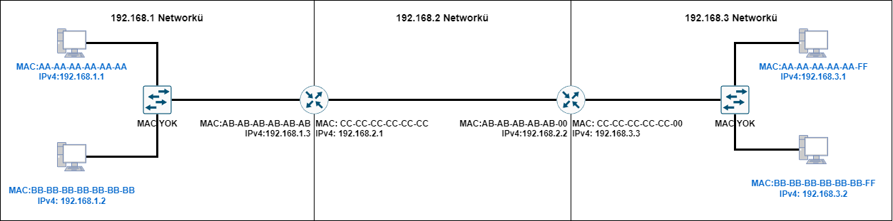
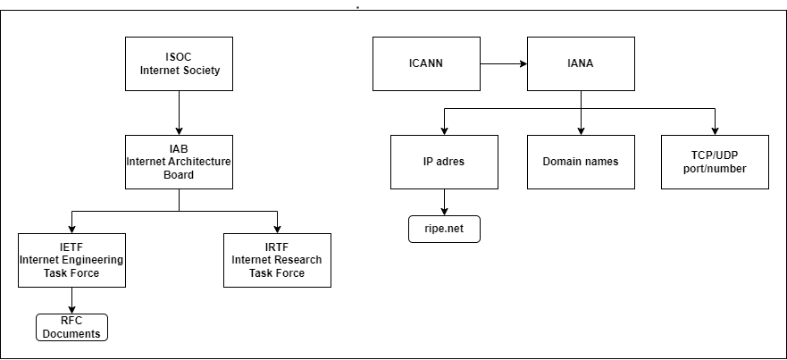
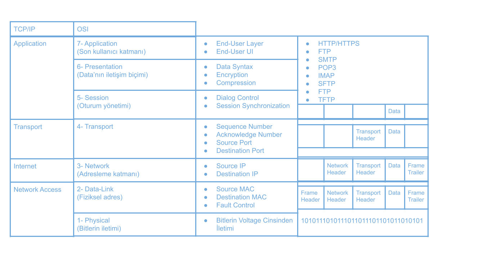
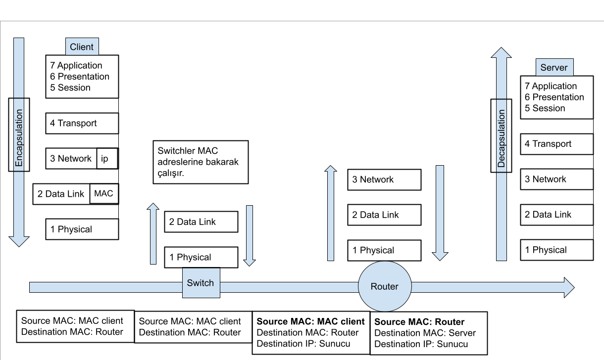

# 3- Protokoller ve Modeller

**TCP/IP**: Günümüzdeki internette kulanılan, 4 katmandan oluşan, protokol kümesidir.
**OSI**: Data haberleşmesinin anlatılması ve açıklanması için tasarlanmış 7 katmandan oluşan modeldir.

## MAC Adresleri ve IPv4 Adresleri
- MAC ve IP, cihazların, aralarındaki iletişimi gerçekleştirmelerinde kullandıkları adreslerdir. Genelleme yapacak olursak MAC adresleri iç ağ haberleşmesinde kullanılırken IP adresleri ağlar arasındaki haberleşmede kullanılmaktadır.

#### **MAC Adresleri:**
- **48 bitten** oluşurlar.
- NIC üzerinde bulunurlar, fiziksel adres olarak da geçerler, eşsizdirler.
- MAC adresleri *9C-35-5B-5F-AA-BB* tazrındadırlar (*0000=0, 0001=1, 0010=2, ..., 1110=E, 1111=F*) (4x2x6=48 bitten oluşmaktadır).
- Ethernet Kartı üzerinde **Bured-in adres**lerdir.
- NIC üzerinde çalışan internet protokolleri cihaz içerisine yüklü gelir ancak istenirse değiştirilebilir, bunlar TCP/IPv4 veya TCP/IPv6'dır.

*Wifi kartı da bir NIC kartıdır.*
#### **IPv4 Adresleri:**
- **32 bit** / 4 kısımdan oluşurlar.
- IP adresleri 192.168.1.5 tazrındadır, alabileceği sayılar (0-255) aralığında olmalıdır, 0 ya da 255 alamazlar. 
- IP adresleri, MAC adreslerindeki kalıcı adreslerin tersine **mantıksal** adreslerdir. "Dynamic addresses" yani dinamik adresler olarak tanımlanırlar.
- IP adresi "192.168.5.1" olan bir cihazın "192.168.5" kısmı "Network" bilgilerini ifade ederken, ".1"  kısmı ise yerel ağdaki "Host" numarasıdır.

### Hatırlatma:
*Router networkleri birbirine bağlayan  ağ cihazıdır, router uçları (interfaceleri) farklı ağlara bakar. Yani bir port 192.168.5 ağına bakıyorsa diğer port 192.168.6 ağına bakar.*

*Switch ise son kullnıcıları ağa dahil eden cihazdır. NIC'leri bulunmaz, bu sebepten MAC'leri de yoktur.*

Bu şekilde **8 adet NIC** ve **7 adet ağ** bulunmaktadır. Bu ağlar:
1- 1.1 & switch
2- 1.2 & switch
3- Switch & 1.3 portlu router 
4- 2.1 portlu router & 2.2 portlu router
5- Switch & 3.3 portlu router
6- 3.1 & switch
7- 3.2 & switch

***

### İletişim Temelleri Oluşturan Temel Unsurları:
- Source (Kaynak).
- Destination (Hedef).
- Media (Ortam).

*Ağlar "scale" ve "complexity" olarak değişebilir, yalnızca bağlantı olması yetmez.*
***
### Mesajların Ağ'daki Hareketi:

*Message Source > Transmitter > Transmission Medium > Reciever > Message Destination*
***
## İletişim Protokolleri:
- Tüm iletişim protokoller çerçevesinde gerçekleşir.
- Protokoller iletişimin izleyeceği kurallardır.
- Kurallar protokollere bağlıdır. Kurallar dizisine ise protokol denir.

5 temel iletişim protokolü vardır, bunlar:

### 1- Encoding:

- Mesajın fiziksel ortamda iletilmesi için uygun hale getirilme işlemidir.
- Encoding işleminin tersi **decoding**'tir, mesajın yorumlanması için çözümlenmesidir.
- Hostlar arası kodlama ortama uygun olmalıdır. Bitler ışık, ses veya elektriksel darbe modeline dönüştürülür, hedef (destination) bunu decoding yardımıyla çözümler.

### 2- Formatting and Encapsulation:

- Bir mesajın gönderilirken belli bir formatta ya da yapıda olması gerekmektedir. Bu format mesajın türüne ve mesaj iletmek için kullanan kaynaklara bağlıdır.

*Data'nın içerisinde version, traffic class, flow control, payload lenght etc. olması bir formatlamdır.*

*Foreshadowing: Encoding fiziksel katmana özgü bir durumken, encapsulation bütün katmanları kapsar.*

### 3- Message Size:

- 500 MB'lık bir dosyayı istersek tek parça halinde gönderebiliriz, ancak iletim sırasında bir sorun sonucu yalnızca bir bit bile yanlış aktarılırsa bütün veri kullanılmaz hale gelir. Bu ölçeklendirilebilir ve kullanışlı değildir. 
- Datayı, küçük parçalar halinde yollamak istersek bu parçaların doğru aktarılması için bir takım kontrol bilgileri gerekmektedir. Adres bilgisi burada devreye girer, bu adres bilgisi verinin kaçıncı dosya olduğunun çözümlenmesinde kullanılır.

### 4- Message Timing:

- Akış kontrolü, iletim hızının yönetiminden sorumludur.
- Connection Timeout, ağdaki cihazların birbirinden yanıt almaması durumunda cihazların ne kadar bekleyecekleri belirler.
- **Flow control** dataların çarpışmaması durumunu İngilizcesiyle **collision** durumunun oluşmasını engeller.
- Collision durumu, ağdaki iletilerin elektiriksel olarak üst üste binmesidir. 

*Foreshadowing: İletim sırasında ağ içerisinde +5V olarak iletilen bitlerin üst üst gelmesiyle collision oluşur.*

### 5- Message Delivery Options:
- **Unicast:** Tek bir kaynak cihazının, tek bir hedef cihazla doğrudan iletişim kurduğu bir mesaj teslimat türüdür. (One-to-One)
- **Multicast:** Bir cihazın birden fazla cihazla yaptığı iletişimdir. Multicast MAC adresiyle çalışır, iletiyle **ilgilenen** cihazlar paketi alır. (One-to-Many)
- **Broadcast:** Bir cihazın ağdaki her cihaza teslimat yapmasıdır. Broadcast IPv4'e özel bir teslimat seçeneğidir. (One-to-All)

*Foreshadowing: Anycast IPv6'ya özel bir teslimat seçeneğidir.*

***

## Ağ Protokollerine Genel Bakış

### 1- Ağ İletişim Protokolleri: 

Ağ İletişim Protokolleri, iki ya da daha fazla cihazın bir veya birden çok ağ üzerinden iletişim kurmasını sağlar, bu protokollerden bazıları şunlardır:

- Ethernet: MAC'lerin kullanıldığı yerel iletişim protokolüdür. 802.3 IEEE protokolü ile temsil edilir.

- IP (Internet Protocol): Global olarak mesajların iletilmesini sağlayan protokoldür. Adresleme işlemini IPv4 ya da IPv6 protokolü tarafından yapılır.

- TCP: Ağda iletilen mesajların güvenli, eksiksiz, akış hızının kontrollü bir şekilde iletilmesini sağlayan protokoldür. Paket sırasını kontrol eder, oluşan hataları tespit eder ve iletiminde sorun çıkan, hatalı paketi göndericiden tekrar ister. TCP **connection oriented** (bağlantı esaslı) bir protokoldür. Bu sebepten dolayı eksiksiz iletim sağlar.

- UDP: UDP, TCP'nin aksine bağlantı gerektirmeyen, kaybolan paketleri geri istemeyen, hata toleransı olmayan, yani kaybolan paketin yok olduğu **connectionless** (bağlantısız) bir iletim protokolüdür. 

- HTTP (Hyper Text Transfer Protocol): Web sayfalarının görüntülenmesinde kullanılan protokoldür. Web sayfalarının içeriğini ve biçimini tanımlar. Web sunucusu ile Web istemcisi arasında iletişimi sağlar. 

### 2- Ağ Güvenlik Protokolleri:

Ağ güvenlik protokolleri kimlik doğrulama (authentication), veri bütünlüğünün korunması (integrity) ve veri şifrelenmesini (data encryption) sağlamak için verileri güvenli hale getirme protokolleridir, bu protokollerden bazıları:

- SSH: Orta adam saldılarının (man-in-the-middle-attack) mümkün olduğu internet ağı üzerinden mesajların güvenli ve şifreli geçmesini sağlayan, bunu da public key kullanarak yapan güvenlik protokolüdür. 
- SSL: TSL'in çıkmasıyla kullanımı azalan, internet güvenlik protokolüdür. Genellikle bankacılık, transaction işlemlerinde kullanılan bir protokoldür. Client ile server arasında, serverın **sertifika** yollaması ile çalışır.
- TSL: SSL'in geliştirilmiş halidir. Temel olarak SSL ile aynı özellikleri taşır.

*Extra: Google, HTTPS yani içerisinde SSL ya da TSL bulundurmayan siteleri "Güvenli değil." olarak adlanırmaktadır.*

### 3- Yönlendirme Protokolleri:

Yönlendiricilerin, rota bilgilerini değiş tokuş etmesini, yol bilgilerinin karşılaştırılmasını ve ağ bağlantısı için en iyi yolun seçilmesini sağlayan protokollerdir. Bu protokollerin bazıları:

- OSPF (Open Shortest Path First): Networkte farklı bölgelerde (area'larda) bulunan ve  komşu olan routerların, birbirlerine ağı öğrettiği protokoldür. Bu protokolü routerlar, komşusu olduğu, farklı bölgede bulunan,komşu routerın fiziksel olarak görmediği ancak kendisinin gördüğü  ağların bilgisini vererek **komuşusunun da ağı öğrenmesini** sağlayan ve bu sayede networkteki bütün routerların birbirlerinden haberdar olduğu protokoldür.

- BGP (Border Gateway Protocol): Internet ağı içerisindeki Autonomus Systemler üzerinden bakılarak, ağ üzerindeki hedefe giden, en kısa yolun bulunmaya çalışıldığı protokoldür.

*BGP protokolünde bulunan kısa ağ yolu, "En kısa yol olacaktır." garantisi yoktur. BGP nin bulduğu yolun geçtiği A.S. (Autonomus Systems), içerisinde yolu uzatan, karmaşık bir ağ yapısına sahip olabilir.*

### 4- Servis Bulma Protokolleri: 

Cihazların veya servislerin kolayca algılanması için kullanılır. Bu protokollerin bazıları:

- DHCP (Dynamic Host Configiration Protocol):  Cihazlara dinamik IP adresleri, subnet maskeleri, default gateway numaraları verir. Elle teker teker girilmesi gerken ağ üzerindeki bu dinamik adresleri otontike eden protokoldür. Genelde ağ üzerinde bu işlemleri yapmak için bir DHCP sunucusu bulunur.

*Foreshadowing: Evlerde bulunan ADSL modemin içerisinde DHCP server bulunur.*

- DNS (Domain Name Systems): Internette bulunan statik IP adreslerini insanların okuyabileceği formata çevrir. 74.125.44.25'in yahoo.com olarak okunması DNS sayesinde gerçekleşir.

*Foreshadowing: Dinamik IP'lerde ise DDNS (Dynamic Domain Name Systems) kullanılır.*

***

## Protokol Kümelerinin Evrimi

- TCP/IP: Amerikan Savunma Bakanlığı tarafından geliştirilmiş en yaygın protokol paketidir. Günümüzde IETF tarafından geliştirilir ve korunur.

- OSI (Open Systems Interconnection): Geliştiricisi ISO (International Standardization Organization) ve ITU (International Telecommunication Union)'dır.

- Apple Talk.

- Nowell Network.

| **Layer Name** 	|       TCP/IP 1980s      	|         ISO         	| Apple Talk 1985-95 	| Nowell Networks 1983 	|
|:--------------:	|:-----------------------:	|:-------------------:	|:------------------:	|:--------------------:	|
|   Application  	|    HTTP DNS DHCP FTP    	|   ACSE ROSE TRSE    	|         AFP        	|          NDS         	|
|    Transport   	|         TCP UDP         	| TP0 TP1 TP2 TP3 TP4 	|  ATP AEP NBP RTMP  	|          SPX         	|
|    Internet    	| IPv4 IPv6 ICMPv4 ICMPv6 	| CONP CMNS CLNP CLNS 	|        AARP        	|          IPX         	|
| Network Access 	|    Ethernet ARP WLAN    	|  Ethernet ARP WLAN  	|  Ethernet ARP WLAN 	|   Ethernet ARP WLAN  	|

*Apple sistemler yalnızca diğer Apple sistemlerle, Nowell sistemler ise yalnızca nowell sistemlerle haberleşebilmiştir.*

***Evrensel protokol mücadelesini TCP/IP esnek yapısı sayesinde kazanmıştır.***

***
## Standart Organizasyonları:
Açık standartların olması birlikte çalışma, rekabet ve yenilik teşvik eder.

- Internet Society (ISOC): İnternetin açık gelişimini ve evrimini destekler.

- Internet Architecture Board (IAB): Standart yönetiminden sorumlulardır. İnternet mimarisnin korunmasını sağlarlar.

- **Internet Engineerring Task Froce (IETF)**: Internet ve TCP/IP protokollerini geliştiren, bu protokollerin bakımını yapan ve güncelleyen kurumdur. Çalışma gruplarında **RFC (Request for Comments)** denilen çalışma dökümanları üretilir.

*HTTP'nin RFC dökümanı açılıp okunabilir, RFC'ler herkese açıktır.*

- Internet Research Task Force (IRTF): Internetin geleceği ile çalışmalara odaklanırlar.

 ### TCP/IP'nin Çalışmasını Denetleyen Organizasyonlar:

- ICANN: IP adresi tahsisi, domain adres yönetimi ve diğer bilgilerin atanmasını kontol ederler. Görevlerinin bir kısmını IANA'ya devretmiştir.

- IANA: IP adreslerini, domain isimlerini  (www.google.com) ve TCP/UDP port numaralarının dağıtımını **(HTTP:80, HTTPS:443, DNS:53)** yapar.

*www.ripe.net Avrupa'da ip dağıtımı yapmaktadır.*

***
## Elektronik İletişim Standartları 
- **⚠️ IEEE (Institute of Electrical and Electronics Engineers):** Ağ oluşturma standartlarını belirler. Cihazlarda bulunan NIC'lerin üzerindeki MAC adreslerinin dağıtımı yapar.

*IEEE 802.3: Ethernet protokolüdür. NIC'leri ve NIC'ler üzerinden haberleşmenin standartlaştırıldığı protokoldür.*

*IEEE 802.11: Wireless LAN protokolüdür.*

- EIA (Electronic Industries Alliance): **UTP kabloları** başta olmak üzere, kabloların ve bağlantı cihazlarının standartlarını belirler.

- TIA (Telecommunication Industries Association): Radyo ekipmanları, hücresel kuleler, VoIP cihazları, uydu iletişimleri gibi cihazların protokollerini geliştirir.

- ⚠️ **ITU-T (International Telecommunications Union - Telecommunication Standardization Sector):** Video sıkıştırma, IPTV (İnternet üzerinden televizyon yayını yapılması teknolojisi) ve dijital abone hattı **(DSL)** gibi iletim yöntemlerinde bant genişliği standartlarını tanımlar.

***

## Referans Modelleri
### ⚠️OSI Referans Modeli:

|  Yukarıdan Aşağıya   Encapsulation 	|                                                                      	| Aşağıdan Yukarı   Decapsulation 	|
|:--------------------------------:	|:--------------------------------------------------------------------:	|:-----------------------------:	|
|             **Layer**            	|                     **Data Capsulation/Decapsulation**                     	|           **Layer**           	|
|           7 Application          	|                                 Data                                 	|         7 Application         	|
|          6 Presentation          	|                                 Data                                 	|         6 Presentation        	|
|             5 Session            	|                                 Data                                 	|           5 Session           	|
|            4 Transport          	|                      (Segment)    Segment Header + Data                        	|          4 Transport          	|
|             3 Network           	|               (Packet)   Packet Header + Segment Header + Data                	|           3 Network           	|
|            2 Data Link         	|  (Frame) Frame Header + Packet Header + Segment Header + Data + Frame Trailer 	|          2 Data Link          	|
|            1 Physical            	|       110110101010100101100101011111000110101010101101010101010      	|           1 Physical          	|

- OSI modeli "All People Seems To Need Data Processing" olarak şifrelenebilir.
- Paket bir cihazdan diğer cihaza giderken tüm katmanlardan geçer.
 
OSI modeli kısaca şu şekilde özeltlenebilir:

7-Application: Son kullanıcı katmanıdır, kullanıcı ara yüzleri bu katmanda oluşturulur. Uygulamaların ağ üzerinden çalışması sağlanır.
6-Presentation: Verilerin formatının ve yapısının belirlendiği katmandır. Gönderilen verilerin anlaşılabilmesini bu katman sağlar.
5-Session: Uygulamalar arası bağlantının kurulması, yönetilmesi ve sonlandırılmasını yönetir.
4-Transport: Üst katmandan gelen "data"nın segmentlere bölünerek alt katmanlara iletiminden ya da alt katmandan gelen segmentelere ayrılmış datanın birleştirilmesinden sorumludur. Alt ve üst katmanlar arasındaki mantıksal geçişten sorumludur.
3-Network: Ağlar arasında iletişimin sağlandığı katmandır. Segmentlere adres bilgisinin eklendiği katmandır. Verilerin takip edeceği yol belirlenir.
2-Data Link: İç networkte datanın taşınmasını sağlayan katmandır. Fiziksel katmanla iletişimin kurulmasını sağlar. Akış kontrolünü ve pakette oluşacak hata durumunda bozulan paketlerin erkenden, yani yukarı katmana çıkmadan önce kontrol edilmesini  sağlar.
1-Physical: Donanım katmanıdır. 1 ve 0 bitlerinin iletilmesini kontrol edilidği katmandır.

***

### TCP/IP katmanında bulunan bazı application protokollerinin özellikleri:

- HTTP/HTTPS: Hyper Text Transfer Protocol network üzerinden Web sayfalarının görüntülenmesinde kullanılır. Port: 80'i kullanır. HTTP Secure ise SSL ya da TSL protokolü ile şifrelenmiş versiyondur. HTTPS port olarak 443'ü kullanır.

- FTP (File Transfer Protocol): Clientlarla sunucular arasında kullanılan bir dosya aktarma protokülüdür. İndirme, yükleme, dosya paylaşımı, depolama gibi işlemleri denetler. Port: 21'de çalışır. TCP kullanır, connection oriented'tir.

- SFTP (Secure FTP): FTP'de doğrulama ve şifreleme olmamasından dolayı kaynaklanan güvenlik sorununu gideren protokoldür. TCP kullanır, connection oriented'tir.

- TFTP (Trivial File Transfer Protocol): Basit, hızlı ancak düşük güvenlikli dosya transferi protokolüdür. FTP ya da SFTP'nin aksine dış ağlarda kullanılnaz. FTP'den farkı TFTP'nin basit olmasıdır. Güvensiz olmasının sebebi SFTP gibi authentication ve bütünlük koruma özelliklerinin olmamasıdır. Ayrıca SFTP ve FTP'nin aksine TCP yerine UDP protokolü üzerinden çalışır. Port: 69'u kullanır.  Cisco switch ve ya router cihazlarında ön yükleme ya da "TFTP Boot" bu protokolle gerçekleştirilir, zaten genelde yalnızca bu işlemi gerçekleştirmek için kullanılır.

- SMTP (Simple Mail Transfer Protokol): Sending message to people olarak akılda kalması için kodlanabilir. SMTP, mail server'ına mail gönderme işleminde kullanılann protokoldür. Mail server'ına SMTP server'ı da denir. TCP protokolü kullanarak mesajların iletilmesi gerçekleştirilir. Mesajın server'dan çekilmesini ise POP3 ya da IMAP protokolü gerekleştirir. Port numarası **25**, 465, 587, ve 2525'dir.

- POP3 ve IMAP: POP3 protokolü serverdan mailin görüntülenmesiyle  mailin serverdan çekilip ardından silinmesiyle çalışır,bu sayede yalnızca tek cihaz serverdan maile ulaşır, ancak ek ayarlardan bu düzenleneblir. IMAP ise serverdan görüntülemeye izin veren cihazların senkronize çalıştğı bir mail indirme protokoldür.

***
### Segmentation (Bölümleme): 
Data network üzerinden tek parça halinde iletilmez, küçük parçalara ayrılır. Bu ayırma işlemine **segmentasyon** denir.
- Transport katmanında data, dataya eklenecek header kısmında TCP kullanılacaksa **segment**'e, UDP kullanılacaksa **datagram**'a dönüşür.
- Network katmanında segmentin ya da datagramın başına IP başlığı eklenerek **packet** oluşturulur.
- Data Link katmanında ise sırasıyla packetin ön ve arka kısmına ethernet header ve trailerın eklenmesiyle **frame** oluşturulmuş olur.
***

### Paket bir cihazdan diğer cihaza giderken tüm katmanlardan geçer demiştik, peki bu durum nasıl gerçekleşir? 

Örneğin Youtube'da kullanılan bir data, application, presentation ve session katmanlarından geçerek transport katmanına ulaşır. Ardından Trasnsport katmanında segment'e dönüşen data, sırasıyla,Network katmanında packete, data link katmanında frame'e, Physical katmanda ise ve bitlere dönüştürülür.
İç ağda cihazların MAC adresleri ile iletişim kurduklarını söylemiştik. Bu durumda, yani iç ağ cihazlarında yönlendirme MAC adresi ile yapıldığından ağdan çıkmak için ulaşmamız gereken son yerel adres router'ın MAC'i dir. Bu yüzden wireshark'da dinlediğimiz google.com'a, yahoo.com'a ya da cisco.com'a giden tüm paketlerin MAC adresinde aynı MAC adresi, yani router cihazın MAC adresi yazar.

    Review the captured data in Wireshark, examine the IP and MAC addresses of the three locations that you pinged. List the destination IP and MAC addresses for all three locations in the space provided.
    Answers:
    yahoo:  IP: 87.248.100.216  MAC: 00 18 b9 b1 4f 
    cisco:  IP: 23.0.88.25      MAC: 00 18 b9 b1 4f 
    google: Ip: 142.250.203.196 MAC: 00 18 b9 b1 4f 

Verinin router'a gelmesiyle network katmanına kadar çıkılmış olunur, önce hedef IP güncellenir, yani gidilecek servera bağlı olan router'ın IP'si yazılır. Ardından Data Link katmanında ISP networkündeki local ağda bulunan bir sonraki cihazının MAC aderesi yazılır.
***
### Kısaca TCP/IP Protokol Paketleri

|                                             TCP/IP                                             	|                                                            Name of Protocols                                                           	|
|:----------------------------------------------------------------------------------------------:	|:--------------------------------------------------------------------------------------------------------------------------------------:	|
| Application Layer:  Kullanıcı verilerinin kodlanmasını,  denetiminin yapılmasını sağlar. 	| DNS: İsim Çözümlenesi  SLAAC/DHCPv4: IP adresleme  STMP/POP/IMAP: E-mail  FTP/SFTP/TFTP: File Transfer HTTP/HTTPS/REST: Web 	|
|        Transport Layer: Farklı ağlar arasındaki  cihazların iletişimini destekler.       	|                                             TCP: Connection Oriented UDP: Connectionless                                            	|
|                         Internet Layer: Ağdaki en iyi yolu belirler.                        	|                  IPv4/IPv6/NAT: Internet Protokolleri ICMPv4/ICMPv6: Mesajlaşma OSPF/EIGRP/BGP: Router Protocols                 	|
|   Network Access Layer: Ağı oluşturan donanım  aygıtlarını ve medyayı  kontrol eder.  	|                                       ARP: Adres Resolution Ethernet/WLAN: Data Link Protocols                                      	|

***
### PDU (Protocol Data Unit): 
Data'nın bulunduğu katmanda aldığı isime PDU denir. 4. katman için segment 3. katman için frame ve 2. katman içn frame denmesi gibi.
- Datagram Transport katmanında görülür eklenti kısmı 8 bytedır. Datanın UDP başlığı alması durumunda oluşur.
- Segment  Transport katmanında görülür eklenti kısmı 20 bytedır. Datanın TCP başlığı alması sonucu oluşur.
- Packet Network katmanında görülür eklenti kısmı 20 bytedır. IP bilgileri taşınır.
- Frame Data Link katmanında görülür eklenti kısmının başı 18 bytedır. Ethernet bilgileri taşınır. Kuyruğunda CRC adında kontrol kısmı bulunur.

***
### **Sınava Özel Notlar:**

- MAC adresleri aynı ağda iletişim yaparken kullanılır.
- IP adresleri farklı ağlar arasında iletişim yaparken kullanılır.
- Source IP adresiyle destination IP adresleri değişmez.
- Günümüzde IP adresleri yetersiz olduğundan NAT yapılır. 
- Switchlerin IP yazılımı yoktur.
- Default Gateway (DGW) farklı networklere çıkışı sağlayan routerın IP adresidir.

