## Data Link Katmanı
- Data Link katmanı denilince akla gelen ilk protokol kuşkusuz **Ethernet** protokolüdür. Ancak Data Link katmanında bulunan tek protokol ethernet protokolü değildir. Wireless LAN, PPP ve HDLC gibi protokoller data link katmanında bulunan diğer protokollerdir.
- - Data Link katmanında kullanılacak medium ya da media'ya uygun enkapsülleme bu katmanda yapılır.
- Bu protokollerden bazıları MAC adresi kullanırken bazıları kullanmaz:

| **MAC adresi kullanan Protokoller** 	| **Başlık bilgileri bulundurmalarına rağmen  MAC adreslerini kullanmayan WAN teknolojileri** 	|
|:-----------------------------------:	|:----------------------------------------------------------------------------------------------:	|
|        Wireless LAN protokolü       	|                                  PPP (Point-to-Point-Protocol)                                 	|
|          Ethernet protokolü         	|                              HDLC (High-Level-Data-Link-Control)                              	|

- PPP (Point-to-Point-Protocol): İki cihaz arasında güvenli ve kesintisiz iletişimi için kullanılan bir protokoldür.
- HDLC (High-Level-Data-Link-Control): WAN'larda noktadan noktaya aktarmalarda hata kontrolü için kullanılan bir protokoldür.
- **Data Link karmanının temel görevi aynı katman üzerinde iletişim sağlamaktır.**
- MAC adreslerini kullnarak hangi NIC'den hangi NIC'e gidileceğini belirleriz, bu işlemi IP adresleri kullanarak yapamayız IPv4 adresleri günümüzde sanal adreslerdir.
- Data Link katmanı pakette **frame** yapısını oluşturur pakete (header) başlık ve kuyruk (trailer) bilgisi eklenir.
- Fiziksel katmana geçiş kontrolü MAC (Media Access Control), ağdaki trafiği kontrol ederek paketlerin çarpışmasını (collision) engeller. Ethernet'te **IEEE 802.3 CSMA/CD** algoritması kullanılırken, WLAN'da **802.11 CSMA/CA** algoritması kullanılır.
- Katman 2'den katman 1'e frame PDU'su bir anda geçemez, MAC (Media Access Control) gibi geçiş kontrol protokolü vardır.

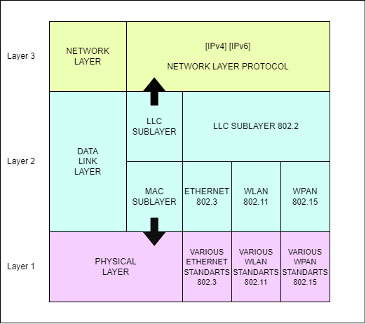

- LLC Sublayer (Logical Link Layer) decapsulation  sırasında PDU'nun layer 2'den layer 3'e geçerken üst katmandaki IP'yi kontrol etmesini sağlar.
- MAC Sublayer (Media Access Control): Encapsulation sırasında layer 2'den layer 1'e geçişi kontrol eder, ayrıca:
    - Framing yapısını tasarlar.
    - MAC ile geçiş kontrolü yapar.
    - Ethernet Protokolü hem 1 hem 2 katmanda çalışır.

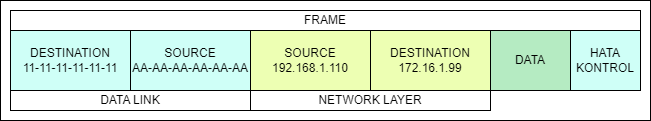

***

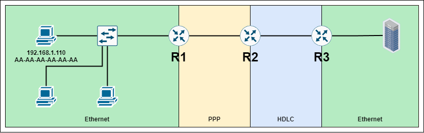

- Ağlar arasında hangi protokoller varsa başlık bilgisi ona göre değiştirilir.
- Paket 1.110 IP adresli cihazımızdan R1'e ulaşınca Data Link paketi atılır, frame'in başına ve sonuna  PPP kısımları eklenir.
- Paket R2'ye ulaşınca PPP başlık ve kuyruk bilgisi atılır, yerlerine HDLC bilgisi eklenir.
- Paketin R3'e ulaşmasıyla HDLC bilgileri header ve trailerdan silinir. Kaynak MAC adrsine R2 routerının MAC adrsi yazılır, hedef MAC adresinen ise Server'ın MAC adresi yazılır. 
- Unutulmamalıdır ki bu ağ yapısında wireless cihazların bulunması durumunda kullanılan protokollerde de değişiklik görülecektir.
- İkinci katman protokolleri sürekli değişebilir.

### Data Link Katmanı Standart Kurumları

- Fiziksel ve Data Link katmanlarında gözlenen IEEE data haberleşme standartları **IEEE 802.3 Ethernet** ve **IEEE 802.11 WLAN (Wireless LAN)**.
- ITU (International Telecommunications Union)
- ISO (International Organization of Standartization)
- ANSI (American National Standarts Instıtue) ADSL cihazlarının standartlarını belirler.

*Hatırlatma: L3, L4, L5, L6 ve L7 standartlarını IETF RFC elemanları ile standartlaştırır.*

***
### Topolojiler
Topolojiler ağların haritasıdır, bu haritalarla ağlarda oluşan problemlerin çözümü sağlanır. Topolojiler 2'ye ayrılabilir, **fziksel topolojiler** ve **logical (mantıksal) topolojiler**. Fiziksel topolojiler cihazların birbirine nasıl bağlandığı ve fiziksel bağlantıların gösterildiği ağ haritasıdır. Mantıksal topolojiler ise ağdaki IP adres planlamaları, cihazların verileri nasıl aktardıkları ve VLAN gibi ağ yöntemleri ile ilgilidir.

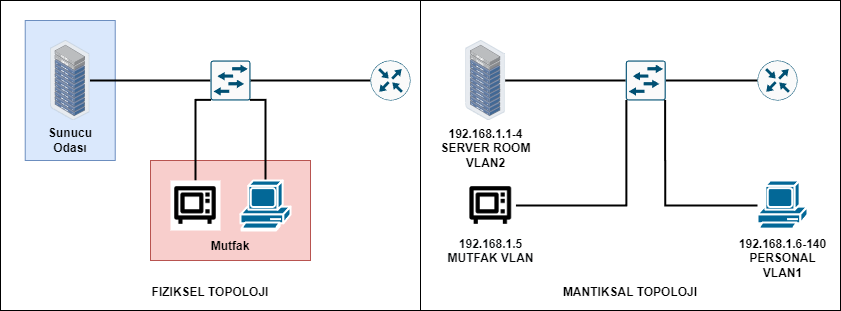

Mantıksal Topolojiler de içinde 2'ye ayrılabilir:
- WAN Topolojiler. Bu topoloji PPP, HDLC ve artık kullanılamyan Frame Relay gibi protokollerin kullanıldığı ağlarda kullanılır.
- LAN Topolojiler.

### WAN Topolojiler: 
- **Point-To-Point**
   P2P (Point-To-Point) topolojisi, iki nokta arasında kalıcı bağlantının sağlandığı, doğrudan karşı tarafa iletimin gerçekleştiği ve nodeların aktardığı medyayı diğer hostlarla paylaşmadığı topoloji türüdür. (CCNA 3'de detaylı işlencektir).
   
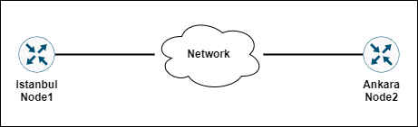

- **Hub And Spoke**
   Merkez ve merkezi çevreleyen şubeler tarzında bir yapısı vardır. Ancak bu topolojide merkezin ölmesi durumunda tüm ağ çöker. Bu topoloji Frame Relay yapısında kullanılan bir topolodir.

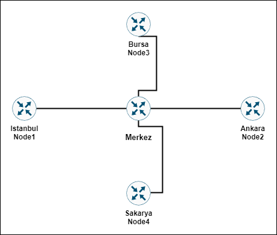

- **Mesh Topoloji**
   Bu ağ topolojisinde bütün nodelar birbirine bağlıdır, bu sebeple en güvenilir topolojidir denilebilir. Ancak her node'u bağlamak için ISP ye para verilmesi gerekldir, bu da maliyetleri çok yükseltir.

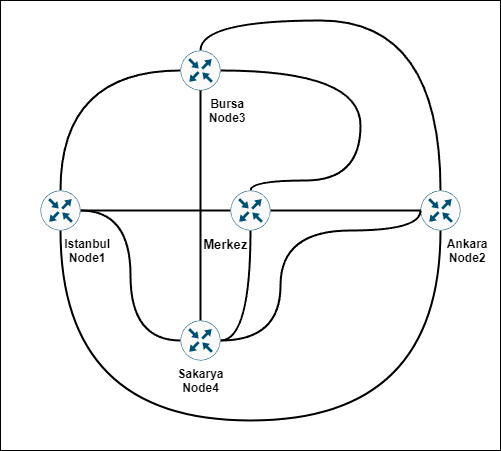

***

### LAN Topolojileri
- **Bus Topoloji**
   Ağ üzerinde aynı anda yalnızca tek cihaz veri alışverişi yapabilir, bu özelliğinden dolayı kullanışlı değildir. Günümüzde kullanılmamaktadır. Bus tipi topolojilerde collision olasılığı yüksektir.
   
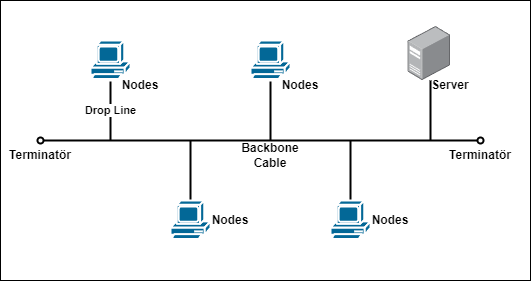

- **Ring Topoloji**
   Ring topolojili iletimi gerçekleştirmek için **Token** adlı bir eklenti kullanılır, datanın önüne eklenen token iletilecek cihaza gelindiğinde iletim işlemi
   tamamlar.
   

- **Star Topoloji**
   Bu topoloji switchlerden önce çıkmıştır. İlk çıktığı zaman merkezinde Hub kullanılan bir topolojiydi. Switchin çıkmasıyla switch, merkezdeki hub cihazının yerini almıştır.

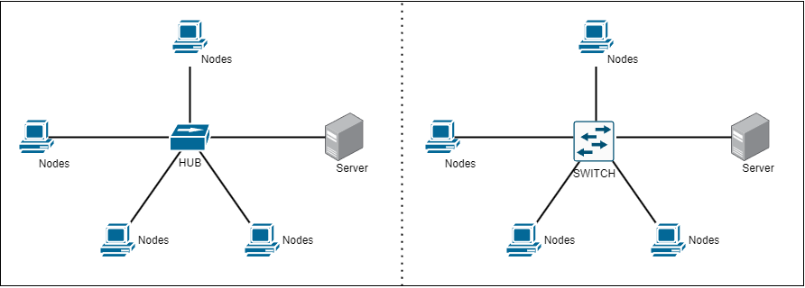

- **Extended Star Topoloji (Hybrid Topoloji)**

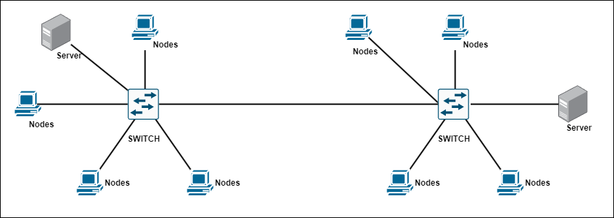

Not: Topolojilerin farklı topolojilerle birleşmesiyle oluşan yeni/farklı topoloji tiplerine hibrit (**hybrid**) topoloji denmektedir.

***

### Half Duplex vs Full Duplex
- İnternet ilk çıktığında internet ağları coaxiel kablolar ve hublardan oluşuyordu, bu cihazlar **half dublex** çalışan cihazlardı. Half duplex çalışan cihazlar yalnızca ileti alabilridi  ya da  ileti verebilridi, half dublex cihazlar aynı anda iki işlemi yapamazlar. Daha sonra switchlerin çıkmasıyla cihazlar **full dublex** olarak haberleşme yapılabilir oldu. 
- Access pointler **half dublex** çalışırlar. Bu yüzden evlerdeki ADSL modemlerde birden fazla Wi-Fi kullanan cihaz iletimi çok etkiler.

Bu şekilde bir cihaz aynı anda yalnızca veri alma ya da veri verme işlemi gerçekleştirebilir. Hublar hızı da paylaşırlar. Hubların hızı 10Mbps ya da 100Mps olarak değişir bu ağdaki toplam kapasite de yalnızca bu kadardır. Bu çalışma half dublextir.

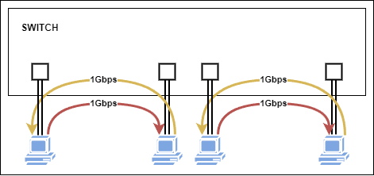

Switchlerde ise aynı anda farklı cihazlarla konuşup veri yollayabilir ve ağda hız düşmesi gerçekleşmez. İletim kablo hızlarında gerçekleşir, collision oluşmaz.Bu tam çift yönlü çalışmaya full dublex denir.

*Not: Switch ile Hub arasındaki en büyük farklardan birisi bu iki cihaz arasndaki iletim kapasitesidir. Hubda çalışan cihazın 10Mbps ya da 100Mbps iletim kapasitesin varken, 24 portlu bir switchin  24 adet 1Gbps'lık recive, 24 adet 1Gbps'lık transmit, toplamda ise 48Gbps toplam anahtarlama kapasitesinin olmasıdır.*
***
### Access Point Methoods
- MAC iletim ortamına geçişin kontrol edilemsini gerçekleştirir. 
- **Ethernette** MAC algoritması olarak **CSMA/CD** kullanılır.
- **Wi-Fi**'de kullanılan MAC algortiması **CSMA/CA'dır**. 
- Bu iki algoritma yarışma bazlı iletişim kurma algoritmalarıdır **(Contention Based)**.
- İletişim hattında boşluğu ilk  bulanın paketini yollanamsıyla çalışan bir algortimadır.

*Not: Token Ring topolojisinde Token Ring algoritması kullanılır. Bu algortima contention based algortimaların aksine **Contention Free ya da Controlled Based** algoritmadır, controlled based algoritmalarda iletim sırayla gerçekleşir rekabet yoktur.*

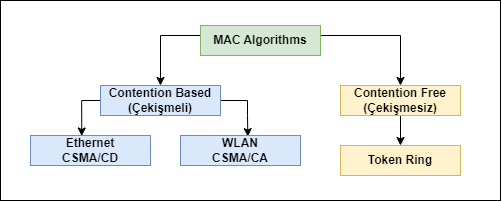

**CSMA/CD**
- CSMA/CD, Carrier Sense Multiple Access Collision Detection anlamına gelir. İsimini sırasıyla ele alırsak:
   - Carrier Sense: Hattı dinle,
   - Multiple Access: Hatta çoklu erişim sağla,
   - Collision Detection: Collision oluşmasını tespit et anlamına gelmektedir.
- CSMA/CD algortiması:
   - Hat boşsa iletim gerçekleştirir, 
   - Hat üzerindeki frameleri dinleyip **collsiion** oluşması durumunda frame iletimini keser, bu sayede gereksiz yere bozuk paketin aktarılmasını engeller,
   - Collsision tespitinden sonra **jam sinyali** yollayar,
   - Jam sinyali ağ üzerindeki bir cihaza ulaşır ulaştırılan cihazda bir jam sinayli yollar, bu sayede ağdaki her cihaz collision oluştuğundan haberdar olur.
   - Sonra random clock belirlenir, rastgele zamanlayıcıya göre iletime  yeniden başlanır.

**CSMA/CA**
- CSMA/CA, Carrier Sense Multiple Access Collision Avoidence anlamına gelir. İsimini sırasıyla ele alırsak:
   - Carrier Sense: Hattı dinle,
   - Multiple Access: Hatta çoklu erişim sağla,
   - Collision Avoidence: Collision oluşmasını önceden engelle anlamına gelmektedir.
- CSMA/CA algortiması:
   - Hat boşsa iletim başlatılır, iletim yapacak cihaz "Benim hatta 5 saniye ihtiyacım var. İletim yapabilir miyim?" gibi bir mesaj yollar,
   - Access Point bu mesajı alıp onayladıktan sonra diğer cihazlara dur mesajı yollar,
   - 5 saniye sonunda farklı bir cihaz iletim hakkı ister ve bu iletim böyle devam eder.

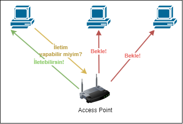

### Data Link Frame (Çerçeve Alanları)

Genel 2. katman protokol alanları şu şekildedir:

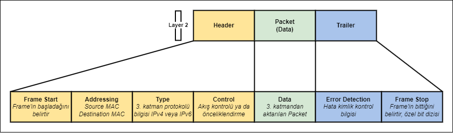

Bu protokol alanları o an ağda cihazlar arasındaki iletişimde kullanılan protokol ne ise ona göre doldurulur. Bu protokoller LAN ve WAN protokolleri olarak  şu şekilde ayrılabilir:

| **LAN Teknolojisi Protokolleri (Bir noktadan çok noktaya bağlama)** 	| **WAN Tekonolojisi Protokolleri (2 Router bağlama)** 	|
|:----------------------------------------------------------------------:	|:-------------------------------------------------------:	|
|                             802.11 Wireless                            	|              PPP (Point-to-Point-Protocol)              	|
|                           Ethernet protokolü                           	|           HDLC (High-Level-Data-Link-Protocol)          	|
|                                                                        	| Frame Relay                                             	|

***

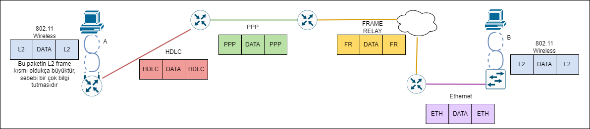

- B makinesi A makinesinin, A makinesi B makinesinin MAC adresini bilemez, MAC adresi yalnızca iç networkte kullanır. 
- PDU'lar dış ağa çıkarken Layer3'e çıkarlar, MAC adresleri çöpe atılır yani MAC adresi mevcut cihazın (genellikle bu routerdır) MAC adresini alır, PDU'nun ulaştırılması planlanan cihazın MAC adresi ise destination MAC olarak yazılır.
*Extra: PPP'de adresi boyutu 8 bittir, bunun sebebi adres numarasının 11111111 olmasıdır. Sonuçta PPP protokolünde MAC adresine gerek duyulmaz, PPP protokolü routerları birbirlerine bağlamakta kullanılan bir protokoldür.

***
## Ethernet Anahtarlandırma

- Ethernet 1. ve 2. katmanda çalışan bir protokolüdür.
- Ethernet framing yapısını oluşturur.
- Ethernet MAC methodu olarak CSMA/CD kullanır.
- Ethernet protokolü kablolar, fiber, UTP, STP, sinyalleşme, konnektörler, data iletim hızları gibi bir çok konuyu denetler.

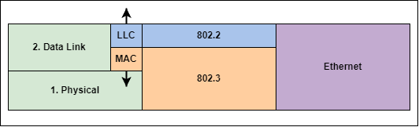

