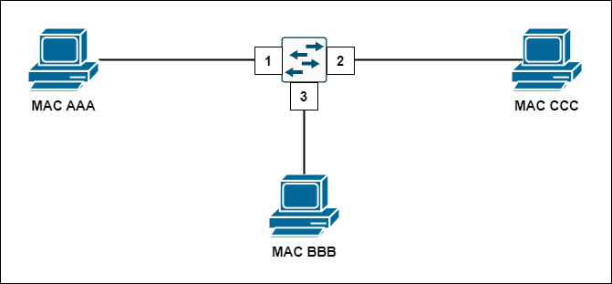
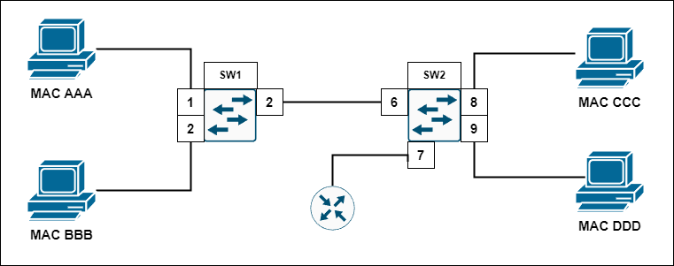
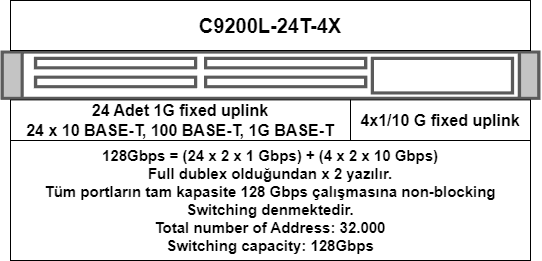

# 7 Ethernet Anahtarlandırma
- Ethernet günümüzde en yaygın kullanılan LAN teknolojisidr.
- Ethernet çok esnek bir protokoldür, ister hub cihazlarında half duplex olsun ister switch cihazlarında full duplex olsun uyumlu ve sıkıntısız çalışır.
- Ethernet 1. ve 2. katmanda çalışan bir protokolüdür.
- Ethernet framing yapısını oluşturur.
- Ethernet MAC methodu olarak CSMA/CD kullanır.
- Ethernet protokolü kablolar, fiber, UTP, STP, sinyalleşme, konnektörler ve  data iletim hızları gibi bir çok konuyu denetler.

Daha detaylı inceleyecek olursak:

- LLC Sublayer, LLC alt katmanı, Data Link katmanından Network katmanına geçişi kontrol eder. Üstteki katmanda kullanılan protokol IPv4 mü IPv6 mı bu bilgiyi tanımlar.
- LLC'nin de bulunduğu ethernet frame yapısı, frame'in oluşma sıraısyla beraber şu şekilde gösterilebilir:

- MAC sublayer medyaya erişimden ve veriyi kapsüllemeden sorumludur. 
- IEEE 802.3 Ethernet protokolünde ethernet frame'in yapısını temel anlamda 3'e ayırmıştır:    
    - Ethernet Addressing: MAC adresi içermesi.
    - Frame datası.
    - Ethernet Hata Tespiti: FCS içermesi.
     
### Ethernet II Frame Yapısı

- Ethernet çerçevelerinde LLC sublayer kısmının yerine Type kullanılır, bu durum LLC'nin kullanılmadığını göstermez .
- **Minumum frame boyutu 6+6+2+46+4=64** byte'tır. Bu hesaplamada Preamble veya SFD dahil edilmez çünkü bu frame yapıları artık günümüzde kullanım dışı olmuşlardır.
- **Maximum frame boyutu 6+6+2+1500+4=1518** byte'tır. 
- 64 bytetan küçük paketler çöpe atılır, bu durumda pakete **collision frame** ya da **runt frame**. Buradaki fikir bir paket 64'ten küçük gelmişse o paket kesinlikle collision'a uğraşmıştır mantığıdır.
- Benzer bir durum paketin 1518'den büyük gelmesi durumunda yaşanır. 1518 byte'tan büyük paketler **jumbo** ya da **baby giant fragmnet** olarak adlandırılır ve çöpe atılır. Jumbo özelliğinin açılması durumunda büyük paketler de kabul edilir hale gelir.

### MAC Adresleri ve Hexadecimallik
- MAC adresleri 48 bitlik adreslerdir
- 12 adet hexadecimallerden oluşurlar.
- Fiziksel adresler şu şekillerde bulunabilir:
    - 1C-5A-81-65-5C-0F
    - 1C:5A:81:65:5C:0F
    - 1C5A.8165.5C0F
- Standart bir laptopun üzerinde 3 veya daha fazla NIC kartı bulunabilir.

- Bu adresleri **IEEE** sağlar. MAC adreslerini mantığı şı şekildedir:

- MAC adresleri değiştirilemeyen , burned-in, adreslerdir olarak ifade etsekte bazı cihazlar üzerindeki MAC adreslerini değiştirmek mümkündür.
- Kali Linux'da MAC adresleri değiştirilebilir, bu değiştirme için MAC changer kullanılır.
- OUI lookup gibi sitelerden cihazların MAC adreslerine bakarak üretici markalarını bulmak ve cihazların seri numaralarını görmek mümkündür.
- 3000$ gibi bir parayla 16 milyon MAC adresi alınabilir. Benzer şekilde gizli MAC adreslerini de almak mümkündür.

### MAC Adres Tipleri
- Tek noktadan tek nokataya yayın yapmaya **Unicast** denir
- Aynı ağda birlikte bulunan,  IPv4 adreslerini bilinen cihazın bir diğer cihaza ping atmasına **Address Resolution Protocol/ARP** denir. ARP yerel ağda MAC adreslerinin öğrenilmesini sağlayan protokoleldir birisidir.
- IPv6 da ARP protokolü yerine aynı işlemi yapan **Neighbour Discovery/ND**  protokolü vardır.
- Ağda bulunan bütün cihazlara koşulsuz şartsız paket yollanmasına **broadcast**  denir. 
- **Broadcast** bütün cihazlara paket yollamayı MAC hedefine **FF-FF-FF-FF-FF-FF** adresini yazarak gerçekleştirir.
- İçerisinde ara cihaz bakımından yalnızca Hub olan ağlarda MAC adreslerinin pek işe yaradığını söyleyemeyiz. Bunun sebebi hublar sürekli broadcast yapar, paketler tüm cihazlara sürekli ilerilir, her cihaz gelen her broadcasti okumak zorunda kalır. Cihazlar sürekli gelen paketlerin MAC adreslerine bakıp bana mı gelmiş diye kontrol etmek zorunda kalır.

- Bir cihazdan birden çok cihaza paket gönderilmesine ise **Multicast** denir.
- IPv4'te multicast gerçekleştirmek için hedef MAC adresine **01-00-SE** yazılır ve IPv4 destination adresi **224-239**'la bitirilirken, IPv6'da destination MAC adresi 33-33 olarak değiştirilirken, IPv6 destination kısmına FF00 yazılır.
- Multicast ağ içerisine broadcast gibi dağıtılır , paketin gelidği port hariç paket her porta iletilir. Ancak yalnızca multicasti dinlemek isteyen cihazlarlar multicast'e erişebilir. 
- If a switch receives a frame with the destination MAC address 01:00:5E:00:00:D9 switch forwards it out all ports except the ingress port.

### Switchler Nasıl Çalışır?
**MAC Adresi Tablosu**
- Hub sinyali kuvvetlendirip iletimi diğer tüm portlara iletir. 10 Mbps hızla 1. katmanda çalışır maksimum 4 hub art arad bağlanabilir ve yalnızca bir cihaz paket alabilir ya da gönderebilir, çünkü hublar half dublex cihazlardır.
- Switch 2. katmanda çalışan bir ara cihazdır. Temel işlevi **MAC adresleme tablosu**nu tutmaktır. Verilere yönlendirme yapar. Hub cihazlarına göre switch cihazları devrim niteliğindedir, paket gönderme paket alma portları birbirinden farklıdır. Aynı anda aynı porttan  1Gbps alıp verebilir. Bu çalışmaya full duplex çalışma denir.
- OSI modelini hatırlayacaksak:
    - L7 Application,
    - L6 Presentation,
    - L5 Session katmanlarında PDU ismi **Data**dır.
    - L4 Transport katmanında dataya source port, destination port ve sequence numarasının eklenemesiyle **segment** oluşur.
    - L3 Network katmanında segemente source ve destination IP eklenmesiyle oluşan PDU'ya **IP packeti** denir.
    - L2 Data Link katmanında pakete frame header ve trailer eklenmesiyle **ethernet frame** oluşur.
    - L1 Pyhsical katmanda ise veriler **bitlere** dönüştürülür ve aktarılır. 1011010101110101010...
- Şimdi bir cihazın sırasıyla ağada nasıl davranış sergilediğine bakalım bakalım:

- ARP, IP adreslerini kullanarak MAC öğrenme protokolüdür.
- MAC adreslerini bilmediğimiz cihazların MAC adreslerini öğrenmek için ARP protokolü kullanılır.
- Yollanan broadcast paketinde ".1.10 IP'li cihaz senin MAC adresin nedir?" sorusu sorulur.

### MAC adres tablosu nasıl oluşturulur?

MAC tablom başlangıçta boş ve MAC AAA'dan MAC BBB'ye frame gönderilecektir. İşlemler şu sırayla gerçekleşir:
1- Frame'in ulaşmasıyla switchin adres tablosunda MAC AAA 1 nolu porta eklenir.
2- Tabloda B'nin yeri aranır, bulunuamaz.
3- A'dan gelen giriş portu harici her porta broadcast yollanır.
4- B cihazı broadcaste cevap verince 2 numaralı porta B cihazı eklenir.
5- A'dan gelen frame B paketine teslim edilir.

MAC tablom başlangıçta her cihaz var ve MAC AAA'dan MAC BBB'ye frame gönderilecektir. İşlemler şu sırayla gerçekleşir
1- A'dan swicthe frame gelir.
2- Tabloda B'nin yeri aranır, bulunur.
3- A'dan gelen frame B paketine teslim edilir.

*Not: Günümüzde MAC adresleri switchlerden kolay kolay silinmez, ilgili portun MAC adresi tabloya kayıt edilir.*

MAC tablom başlangıçta boş ve MAC AAA'dan MAC BBB'ye frame gönderilecektir. İşlemler şu sırayla gerçekleşir:
1- Frame'in ulaşmasıyla switch 1'in adres tablosunda MAC AAA 1 nolu porta eklenir.
2- SW1 tablosunda B'nin yeri aranır, bulunuamaz. A'dan gelen giriş portu harici her porta broadcast yollanır.
3- SW1'den SW2'ye yollanan broadcast SW2'ye ulaşır, SW2 MAC A'yı 6 numaralı porta ekler.
4- SW2 tablosunda B'nin yeri aranır, bulunuamaz. A'nın gelen giriş portu harici her porta broadcast yollanır.
5- B'nin cevabı SW1'e ulaşır. MAC B SW1 tablosuna eklenir. İşlem tamamlanır.

MAC C, MAC B cihazına frame yollayacaktır, mecvut tablolarla bu işlemler şu şekilde gerçekleşir:
6- Frame'in ulaşmasıyla switch 2'in adres tablosunda MAC CCC 8 nolu porta eklenir.
7- SW2 tablosunda B'nin yeri aranır, bulunuamaz. C'dan gelen giriş portu harici her porta broadcast yollanır.
8- SW2'den SW1'e yollanan broadcast SW1'e ulaşır, SW1 MAC C'yı 3 numaralı porta ekler.
9- SW1 tablosunda B'nin yeri aranır, bulunur. Gelen frame B'ye aktarılır.

MAC D, FFF yollayacaaktır, mecvut tablolarla bu işlemler şu şekilde gerçekleşir:
10- Frame'in ulaşmasıyla switch 2'in adres tablosunda MAC DDD 9 nolu porta eklenir. Broadcast yollanır.
11- SW2'den SW1'e yollanan broadcast SW1'e ulaşır, SW1 MAC D'yi 3 numaralı porta ekler.

Router , FFF yollayacaaktır, mecvut tablolarla bu işlemler şu şekilde gerçekleşir:
12-Frame'in ulaşmasıyla switch 2'in adres tablosunda MAC Router 7 nolu porta eklenir. Broadcast yollanır. SW2'den SW1'e yollanan broadcast SW1'e ulaşır, SW1 MAC Routerı 3 numaralı porta ekler.

MAC B, MAC C cihazına frame yollayacaktır, mecvut tablolarla bu işlemler şu şekilde gerçekleşir:
13- Frame'in ulaşmasıyla zaten SW1 tablsounda adresi bulunan MAC C'ye iletim portu 3'ten mesaj yollanır.
14- SW1'den SW2'ye yollanan unicast SW2'ye ulaşır, SW2 MAC B'yi 6 numaralı porta ekler. SW2 tablosunda bulnan C'ye frame iletilir.
Son durumda sritch tabloları şu şekildedir:

| port 	|  SW1 Table  	|  SW2 Table  	|  port 	|
|:----:	|:-----------:	|:-----------:	|:-----:	|
|   1  	|    A (1)    	|    A (3)    	|   6   	|
|   2  	|    B (5)    	| Router (12) 	|  7 	|
|   3  	|    C (8)    	|    C (6)    	|   8   	|
|   3  	|    D (11)   	|    D (10)   	|   9   	|
|   3  	| Router (12) 	|  MAC B (14) 	|   6   	|

- **show mac-address-table** swicthteki MAC adres tablosunu gösterir.
- Bu işlemlerin tamamı millisaniyeler almaktadır.
- Tablolar bu şekilde 5dk kalır (Ancak genelde silinmez).
- Switchler genelde 8000 ila 16000 arası MAC adresi tutarlar.
- Switchler diğer swicthlerdeki adresleri tutarlar.
- Switch'in temel görevi MAC tablosunu tutmaktır, bu tablonun bir diğer ismi CAM tabledır. Bu switch içerisinde bulunan bir flash bellektir. ço hızlı yazma ve okuma kapasitesine sahiptir.
- Switchler kaynak MAC adresini kayıt edip mesajı gitmesi gereken yere ulaştırırlar.
- Swicthlerin MAC adresi yoktur, bu yüzden bir PC switchin MAC adresine gidemez.

***

### Swicthlerin Çalışmasıyla Alakalı Ek Bilgiler
Frameler medium üzerinde iletilirken ara yada son kullanıcı cihazlarına ilk header, data ve son olarakda trailer kısmı gelir. 
**Store and Foward Switching** 
- Switch gelen frame'i içerisinde tutar ve trailer kısmını kullanarak bir hata oluşmuş mu oluşmamış mı diye frame'i kontrol eder.
- Bu kontrolde CRC değeri kullanılır ve CRC değeri FRC'deki verilerle karşılaştırılır.
- Bozuk olması durumunda kimseye haber vermeden paket silinir. Switchler kaynağa "Gönderdiğin paket bozukmuş tekrar gönder!" demez.
- Store and Foward yavaştır bir en sağlam kontrol yöntemidir.

**Cut Throught Switching**
- Store and Foward Switching'in yavaşlığından dolayı ortaya çıkmıştır.
- İlk gelen kısmın header olduğunu söylemiştik, hatırlarsak gelen frame'in içerisinde de ilk kısımda destination MAC adresi yer almaktadır. Bu sayede frame gelir gelmez iletilmesi gereken kısma aktarılmaya başlanır.
- Herhangi bir hata kontrol mekanizması yoktur ancak çok hızlıdır.
- Cisco cihazlar  Cut Throught Switching yaparlar.
- Cut Throught Switching ikiye ayrılır, Fast Foward Cut Throught ve Fragment Free Cut Throught swicthing.

**Fast Foward Swicthing**
- Destination MAC okunur okunmaz iletime başlanır.
- Destination MAC adresi 48 bit yani 6 byte olduğundan ilk 6 byte'den sonra iletim yapılmaya başlar.

**Fragment Free Cut Throught Swicthing**
- Bir frame'in alabilceği en az byte miktarı 64'tür, framelerin bu özelleğinden yararlanıralak kullanılan bu yöntem Fragment Free Cut Throught Swicthingdir.

- Özetle Store and Foward Switching frame'in tamamnı okur  FCS kontrolü yapar, Fast Foward Swicthing ilk 6 byte olan destination MAC adresini okur ve Fragment Free Cut Throught Swicthing framelerin alabilceği minumum byte uzunluğu olan 64 byte'ı okuduktan sonra aktarım yapar.

### Memory Buffering 
- Memory Buffering switchlerde hafıza tampolanmasını tanımlamakta kullanılır. 
- Hafıza tampolanması, ethernet framelerinin yüksek hızlarda switche gelip düşük hızlarda çıkışı durumunda switch'in içerisinde  oluşan frame trafiğinin saklanmasıdır. 
- Bu saklama genelde 2 şekilde yapılır:
    1- Port bazlı hafıza (Port-Based Memory): Her portun ayrı belli bir hafızasının olduğu durumdur.
    2- Paylaşılan hafıza (Shared Memory):  Pyalaşılan ve ortak kullanılan bir hafıza vardır.
- Framler kuyruk alanını doldurursa bazı framler silinir bu durum Port bazlı bir problemdir.
- TCP bu sorunu üst katmanlarda çözer. (Paketi tekrar isteyecektir).
- Shared memoryde frameler karışmasın diye başlarına port numarası eklenir.

### Dublex ve Speed Settings (Çift Yönlülük ve Hız Ayarları)
- Hub cihazı half dublex çalışan bir cihazlardır, switch cihazları ise full dublex çalışırlar.
-  Switche Hub cihazı bağlamak istersek hub swicth'in kullanığı full dublexe dönemez ancak switch half dublexe dönebilir.
- Cihazlar kendi aralarında half ya da full dublex anlaşması yapabilirler. 3 temel anlaşma vardır:
a- Half Dublex,
b- Full Dublex,
c- Automatic (Default)
- Autonegotiation, çoğu ethernet kartında ve NIC'te bulunan ethernet katmanındaki cihazlar arasındaki en uygun hızı ve dublex ayarlarını ayarlanmasından sorumlu algoritmadır.
- **Gigabit ethernet bağlantı yalnızca full dublex çalışır. Ancak bu durum sorun yaratan bir durum değildir çünkü hub cihazları yalnızca 10/100Mbps hızında çalışırlar.**
- Eğer iki cihaz aralarında aynı dublex bağlantısını kuramazlarsa cihazlar ağ üzerinde collision olduğunu düşünürler, bu duruma **dublex mismatch** yani dublex uyumsuzluğu denmektedir. Dublex mismatch yüksek performans sorunu yaratır.
- Autonegotiation hızı  yüksekten düşüğe hızları deniyerek  belirlerler. Örneğin sırasıyla 1Gbps 100Mbps ve 10Mbps ortak hız bulunana kadar denenir.

Hatırlarma: Switchle-switch ve routerla-PC arasında corssover; switchle-router ve switchle-PC arasında straight kablolama kullanılır. Ancak günümüzde bu kablolamalar tarih olmuştur Auto-MDIX (Medium Dependant Interface Crossover) teknolojisi sayesinde anahtar portlara bağlı kablo tipini otomatik olarak ayarlar ve kabloya uygun yapılandırma yaparlar. Biz bu teknolojinin olduğunu bilsekte doğru kablolama yapmamız daha doğrudur. Cisco IOS 1212 ve üzeri cihazlarda Auto-MDIX teknolojisi vardır. Eğer bir bilgisayarda ya da cihazda bu özellik kapalıysa **mdix auto** yazarak açılabilir.

