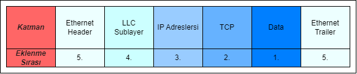
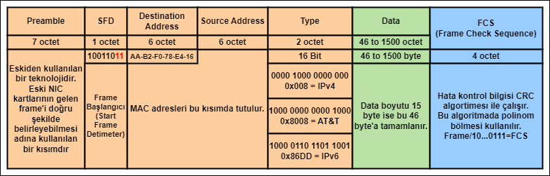
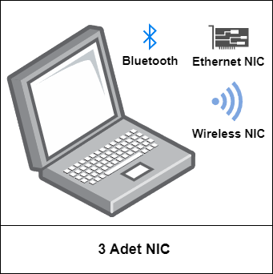

## 7-Ethernet Anahtarlandırma
- Ethernet günümüzde en yaygın kullanılan LAN teknolojisidr.
- Ethernet çok esnek bir protokoldür, ister hub cihazlarında half duplex olsun ister switch cihazlarında full duplex olsun uyumlu ve sıkıntısız çalışır.
- Ethernet 1. ve 2. katmanda çalışan bir protokolüdür.
- Ethernet framing yapısını oluşturur.
- Ethernet MAC methodu olarak CSMA/CD kullanır.
- Ethernet protokolü kablolar, fiber, UTP, STP, sinyalleşme, konnektörler ve  data iletim hızları gibi bir çok konuyu denetler.

Daha detaylı inceleyecek olursak:

- LLC Sublayer Türkçe'siyle LLC alt katmanı, Data Link katmanından Network katmanına geçişi kontrol eder. Üstteki katmanda kullanılan protokol IPv4 mü IPv6 mı bu bilgiyi tanımlar.
- LLC'nin de bulunduğu ethernet frame yapısı, frame'in oluşma sıraısyla beraber şu şekilde gösterilebilir:

- MAC sublayer medyaya erişimden ve veriyi kapsüllemeden sorumludur. 
- IEEE 802.3 Ethernet protokolünde ethernet frame'in yapısını temel anlamda 3'e ayırmıştır:    
    - Ethernet Addressing: MAC adresi içermesi.
    - Frame datası.
    - Ethernet Hata Tespiti: FCS içermesi.
     
### Ethernet II Frame Yapısı

- Günümüzde LLC yerine Type kullanılır.
- **Minumum frame boyutu 6+6+2+46+4=64** byte'tır. Bu hesaplamada Preamble veya SFD dahil edilmez çünkü bu frame yapıları artık günümüzde kullanım dışı olmuşlardır.
- **Maximum frame boyutu 6+6+2+1500+4=1518** byte'tır. 
- 64 bytetan küçük paketler çöpe atılır, bu durumda pakete **collision frame** ya da **runt frame**. Buradaki fikir bir paket 64'ten küçük gelmişse o paket kesinlikle collision'a uğraşmıştır mantığıdır.
- Benzer bir durum paketin 1518'den büyük gelmesi durumunda yaşanır. 1518 byte'tan büyük paketler **jumbo** ya da **baby giant fragmnet** olarak adlandırılır ve çöpe atılır. Jumbo özelliğinin açılması durumunda büyük paketler de kabul edilir hale gelir.

### MAC adresleri ve Hexadecimallik
- MAC adresleri 48 bitlik adreslerdir
- 12 adet hexadecimallerden oluşurlar.
- Fiziksel adresler şu şekillerde bulunabilir:
    - 1C-5A-81-65-5C-0F
    - 1C:5A:81:65:5C:0F
    - 1C5A.8165.5C0F
- Bu adresleri IEEE sağlar.

