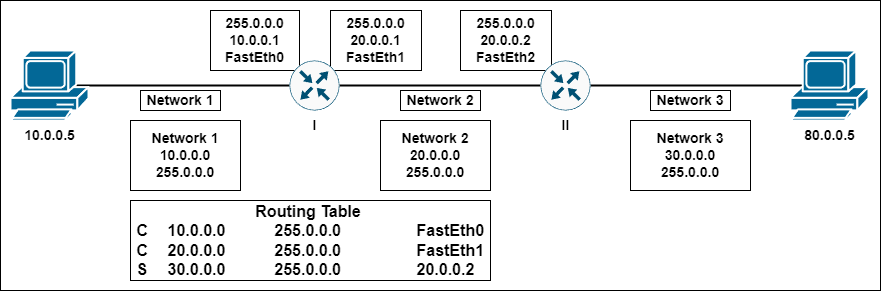
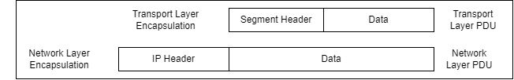
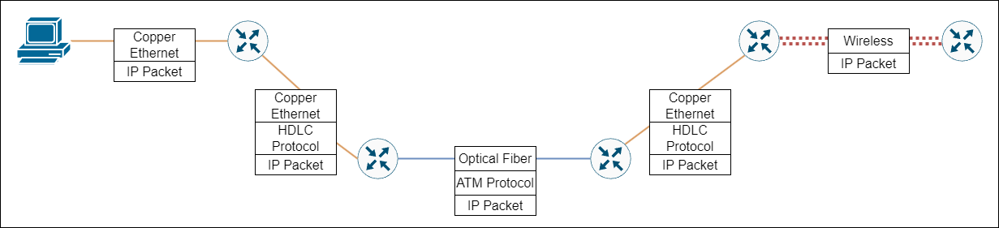
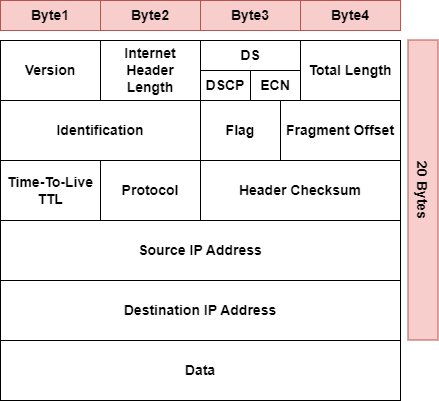
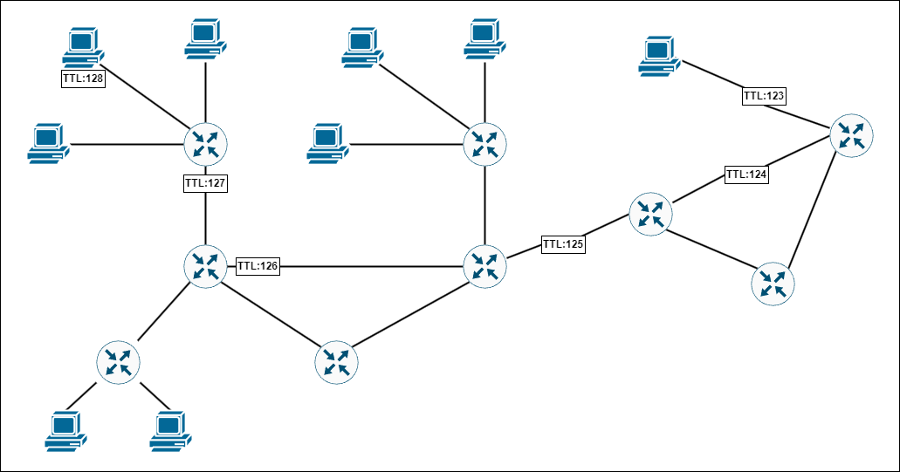
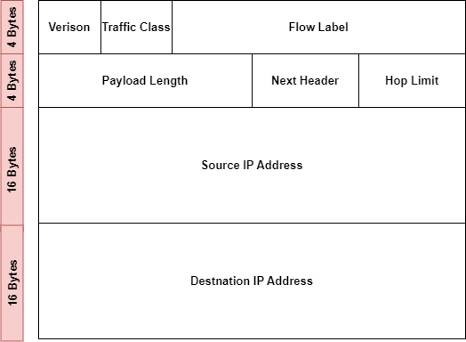
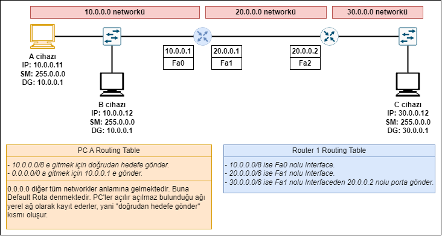
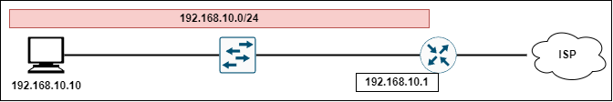
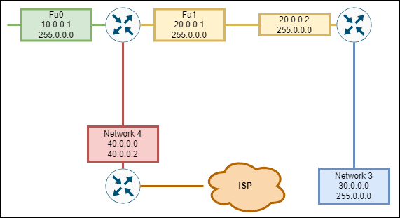

# 8 Network Katmanı
- Data Link katmanında type kısmını etkileyen katmandır.
- Routerların switchlerdeki MAC table'a benzer routing table'a sahiptirler. Routerlar bu tablolara bakarak yönlendirme yaparlar. Unutulmamalıdır ki routerların temel görevi yönledirme yapmaktır.
- Ağ katmanı temelde 4 işlem içerir bunlar:
1- Addressing
2- Encapsulation
3- Routing (Best Path Selection/Packet Switching): Best Path Selection, routerda oluşturulan routing tablosuna bakılarak yönlendirilme yapılmasıdır. Packet Switching, Paketin seçilen yoldan iletilmesidir.
4- Decapsulation
- Routing Table'da 850.000 satır bulunur.
- Bir Routing Table ve bulunduğu ağ şekilde gösterilmiştir.

***

### IP Kapsülleme ve IP Özellikleri

- IPv4 32 bit IPv6 ise 128 bittir.
- IP adresi kaynaktan hedefe ulaşana kadar değişmez.
- ANCAK, NAT adreslemeyi değiştirecektir, paket edindiği bu sahte IPv4 adresini hedefe gidene kadar taşıyacaktır.
- Ama bu durum IP adreslerinin hedefe gidene kadar aynı kalmayacağının kanıtı değidlir. NAT günümüzde IPv4'ün yetersiz sayıda olmasından dolayı ortaya çıkmış bir çözümdür.
- IP özellikleri aktarılacak frame'in en düşük yüke sahip olmasına göre tasarlanmıştır. IP şu şekilde tanımlanabilir:
1- Bağlantısız (Connectionless)
2- En İyi Çaba (Best Effort)
3- Medyadan bağımsız (Media Independent)
- Sırasıyla bunları ele alırsak:
**1- Bağlantısız (Connectionless)**
- TCP connection oriented bir protokoldür, paketlerin ulaşmadığı durumda TCP paketi tekrar ister ancak IP de UDP gibi böyle bir protokol değidlir.
- IP protokolü bağlantısızdır, yani IP bir paket yollamadan önce bir bağlantı kurmaz. IP'de bu işlemlerde kullanılan senkronizasyon veya onay bilgileri yoktur.
**2- En İyi Çaba (Best Effort)**
- IP ben elimden geleni yaparım paket giderse gider gitmezse gitmez modunda çalışır. Paketin ulaşıcağına dair garanti vermez.
- Onay da beklemez.
- IP yalnızca pakete hedef ve kaynak adresini yazar ve yollar.
- Kontrolü de TCP'ye bırakır.
**3- Medyadan bağımsız (Media Independent)** 

- IP fiziksel katmandaki kablo türünü ya da data link katmanındaki frame'in türünü önemsemez ve ilgilenmez.
- IP herhangi bir ortam üzerinden gönderilebilen medium'dan bağımsız farklı (bakır/fiber/kablosuz) ağlarda çalışabilen bir protokoldür.

***
**MTU Maximum Transmission Unit**
- Network katmanı çok önemli özelliklerden birisi olan **MTU** 'yu (Maximum Transmission Unit) kurar.
- Frame boyutları maksimum olarak 14 byte ethernet header + 1500 byte data + 4 byte trailer kısmı olmak üzere 1518 olabilirler.
- Ancak MTU değeri max 1500 bytetır. Ağlarda iletim MTU'nun maksimum 1500 olmasından ötürü 1500 byte olarak yapılmaktadır.
- Eğer MTU max değeri değiştirilip 500 e getirilirse 1500 bytelık paket 3'e ayrılır ve 500 500 500'lük paketler oluşturulur.
- Bu ayrılmış paketler alıcı cihaz tarafından birleştirilmektedir.
- Bu olaya **fragmantasyon** denmektedir.
- Genelde Firewall'lar bu paketleri çöpe atarlar bunun sebebi bu paketlerin bilrşince ciddi güvenlik riski yaratmalarıdır.
- IPv6'da fragmantasyon yoktur. Günümüzde ağlar iletim 1500 byte olarak yapılır.
***
**IPv4 Başlık Yapısı**
Hedefler:
- Hedefin doğru adrese gitmesini sağlamak.
- Network katmanının çalışmasını sağlayarak verilerin doğru yere aktarılmasını sağlamak.
- Tüm 3. katman cihazlarının paketleri işlemek için başluk bilgilerinden faydalanmasını sağlayacak başlığı oluşturmak.

**IPv4 Başlık Alanı**

- Version: IPv4/IPv6 3. katmandaki protokolü belli eder.
- Internet Header Length: Başlık uzunluğu yani Packet Header uzunluğu tutulur. Bu uzunluk 20 bytetır.
- DS: QoS kısmıdır, paketlere öncelik verilmek için kullanılır.
- Total Lenght: Başlık ile Data uzunluğunun toplamı bu  kısımda tutulur. Örneğin TL: 92 bytes ise datamın uzunluğu 72 bytetır.
- Identification, Flag, Fragment Offset: Data'nın yolda bölünmesinin kontrolünden sorumlulardır.
- TTL (Time To Live): Paketin yaşam ömrüdür. Paketin kaynaktan sonra geçebilceği router sayısını belirtir. Her router geçişinde TTL 1 azalır.
- Protokol: Üst katmanda çalışan protokolü temsil eder. Örneğin TCP:6, UDP:17, ping:1'dir.
- Header Checksum: Başlık belli bir polinoma bölünür. Kontrol sonucu devam eder ya da çöpe atılır.
***
**IPv4 Header Fields**    
        
        + Frame 7: 106 bytes on wire // 14 + 92, 14 = 6 + 6 + 2 = Source MAC + Destination MAC + Type
        + Ethernet ...
        - Internet Protocol Version 4, Src: 11.11.11.10, Dst: 22.22.22.40
            Version: 4
            Header Length: 20 Bytes
        + Differentiated Services Field // QoS (Önceliklendirme Alanı)
        Total Length: 92 // (72+20) 
        Identification...
        + Flags: 0x02 (Do NOT fragment) //Datayı küçük parçalara bölmek yasaktır.
        Fragment Offset: 0
        + TTL: 63 //63 router daha geçebilir.
        Protocol: ICMP(1) // ping atılmış bir pakettir, TCP 6, UDP ise 17dir.
        + Header Checksum...
        Souce...
        Destination...  
        +...

***
**TTL**

- Her atlama noktasına **hop** denir.
- TTL cihaz 123'le ulaşır.
- TTL yanlış yönlendirilme sonucu ağın boşuna yorulmasının engelenmesi için oluşturulmuştur.
- TTL olmazsa paket ağda dönüp durur ağ kullanılmaz hale gelir, bu duruma **routing loop** denmektedir.
- TTL çeşitli işletim sistemlerinde değişiklik gösterir, örneğin:
    Linux Kernel 64
    Google Linux 64
    Free BSD 64
    Windows XP 128
    Windows Vista and 7 128
    Cisco IOS 255
- IPv4 adresinin 32 bit yani 2^32 adresi vardır bu da yaklaşık 4.000.000 adres yapmaktadır.
- Bu IP sayısı günümüzde yeterli olmamaktadır, bu sebepten dolayı NAT teknolojisi kullanılmaktadır ancak NAT teknolojisiyle **uçtan uca** erişim özelliğini kaybetmiş olduk.
- Türkiye'de 5651 sayılı kanunla NAT log'u tutulması zorunlu tutulmuştur.
***
**IPv6 Genel Bakış**
- IETF tarafından geliştirilmektedir.
- IPv4 yerine geliştirilmektedir.
- IPv4 32 bitken IPv6 128 bittir yani 2'128 adres ihtimali vardır, bu da yaklaşık 340 undesilyon potansiyel adres yapmaktadır.
- Başlık IPv4'e göre basitleştirilmiştir, IPv4 12 adet başlık alanından oluşan 20 bytlelık bir kısımken,  IPv6 8 adet başlık alanından oluşan 40 bytlelık bir kısımdır.  
- NAT ihtiyacına gerek kalmamıştır. Uçtan uca bu sayede kullanılabilir.
- IPv6 paketi toplamda 40 bytetır.

- Verison: IPv6 da 4 bitlik alan 0110 olacaktır.
- Traffic Class: Önceliklendirmenin yapıldığı kısımdır.
- Flow Label: Oturum takibi sağlar.
- Payload Length: IPv4'ün aksine yalnızca data boyutu burada tutulur.
- Next Header: Üst katman bilgisi tutlur.
- Hop Limit: TTL alanının IPV6 verisiyonudur
⚠️ IPv6'da next header kullanarak ek boşluklar desteklenmektedir.
***
Bir cihazın internete çıkması için 4 adrese ihtiyaç vardır. Bu adresler:
1- IP adresi 192.168.10.10
2- Subnet Maskesi 255.255.255.0
3- Default Gateway 192.168.10.1, framelerimi başka networklere çıkartacak/ulaştıracak routerın network adresidir.
4- DNS 8.8.8.8, (www.google.com) yazınca hangi IP'ye gideceğimi bu protokol belirlemektedir.
***
**Host Routing**
- Paketler her zaman kaynakta oluşmaktadır.
- Her host kendi yönlendirme tablasonu oluşturur.
- Bir host 3 farklı şekilde paket gönderebilmektedir.

1- Itself 127.0.0.0 (IPv4) ve ::1 (IPv6)
- Bu adrese **loopback** adresi denmektedir (127.x.x.x) tarzı adresler loopback adreslerdir.
- Loopback adresler cihazın ağı çalışıyor mu çalışmıyor  mu bunu kontrol etmek için kullanılır örneğin 127.0.0.1 adresine ping atılması durumuyla bu gerçekleşir.
- Bir web sunucusunda sunucu hizmeti çalışıyor mu çalışmıyor mu bunun kontrolü için http://127.0.0.1 kullanılır. Paket kendine ulaşır ve web sayfası açılır.
- Çok basit bir kontrol yöntemdir.

2- Local Host
- İç network iletişiminde IP adresi ve subnet maskesi yeterlidir default gateway'e ihtiyaç yoktur çünkü ağ dışana çıkmaya gereklilik söz konusu değildir. 
- Cihazlar yerel ağlarda IP'leri ARP sorgusuyla MAC öğrenmek için kullanırlar.

3- Remote Hosts
- Uzak networklere erişmek için bu yöntem kullanılır.
- Default Gateway adresi faklı networklere gitmek için gereklidir.

⚠️ Not: Aynı networklerde IP ve Subnet Maskesi yeterliyken, farklı networklerede IP, Subnet ve Default Gatewaye ihtiyaç vardır
⚠️ Not: Bazen IP adresleri 192.168.10.1/16 şeklinde gösterilir bu gösterime **Prefix** gösterim denmektedir. /16, 255.255.0.0 subnet maksesiyle denktir, ilk 16 bit host kısmını temsil etmektedir.
***
**Default Gateway**
- Dış ağa çıkan router cihazının iç ağa bakan IP adresidir (Zaten bütün routerlar dış networke çıkmaya yarar). 
- Başka networklere çıkarken kullanılır, frame içerisinde hedef MAC adresi kısmına default gateway'in MAC adresi yazılır.
- IPv4'te ağda bulunan cihazlar DHCP sunucusunu broadcastle uyarırlar ardından **cihazlar DHCP sunucusundan IPv4 alır**lar.
- IPv6 ise RS denilen Router Solicitation aracılığyla bu işlem gerçekleştirilir ya da manual olarak bu işlem yapılır.

***

PC'nin Routing Table'ı aşağıda verilmiştir:

| **Network Destination** 	|   **Netmask**   	|  **Gateway** 	| **Interface** 	|
|:-----------------------:	|:---------------:	|:------------:	|:-------------:	|
|         0.0.0.0         	|     0.0.0.0     	| 192.168.10.1 	| 192.168.10.10 	|
|        127.0.0.0        	|    255.0.0.0    	|    On-Link   	|   127.0.0.1   	|
|        127.0.0.1        	| 255.255.255.255 	|    On-Link   	|   127.0.0.1   	|
|     127.255.255.255     	| 255.255.255.255 	|    On-Link   	|   127.0.0.1   	|
|       192.168.10.0      	|  255.255.255.0  	|    On-Link   	| 192.168.10.10 	|
|      192.168.10.10      	| 255.255.255.255 	|    On-Link   	| 192.168.10.10 	|
|      192.168.10.255     	| 255.255.255.255 	|    On-Link   	| 192.168.10.10 	|

Buradan 3 temel çıkarım yapabiliriz:
1- 0.0.0.0/0 adresi tabloda bulunan network adreslerinin dışındaki tüm adreslerin adresidir.
2- 127.0.0.0/8 cihazın kendisiyle konuşmasını temsil eden network adresleridir.
3- 192.168.10.0/24 adresinde tüm cihahzlar aynı networkte olduğundan framelerin direkt ulaşması mümkündür.

⚠️PC'de yönledirme tablsonu görmek için **route print** ya da **netstat -r** yazılır.
Bu kodun yazılmasıyla network interface kartlarının listesi verilir.

| **Kaç Nolu NIC** 	|   **MAC adresi**  	| **İsmi / Markası** 	|
|:---------------:	|:-----------------:	|:------------------:	|
|        16       	| A4 B7 56 45 6F 0A 	|   Realtek Wifi 6   	|

Ardından IPv4 ve IPv6 routing tablosu verilir.

| **Network Destination** 	|   **Netmask**   	|  **Gateway** 	| **Interface** 	|
|:-----------------------:	|:---------------:	|:------------:	|:-------------:	|
|         0.0.0.0         	|     0.0.0.0     	| 192.168.10.1 	| 192.168.10.10 	|

***
Routerlarda routing 2 farklı şekilde yapılabilir:
1- Statik Routerlama,
2- Dynamic Routerlama.

**1- Statik Routerlamayla Routing Table**

| Routing  Sırası 	|             Type            	| IP Adresi 	| Subnet Maskesi 	| Port 	|                               Yorum                               	|
|:------------------:	|:---------------------------:	|:------------:	|:-----------------:	|:----:	|:-----------------------------------------------------------------:	|
|          1         	| C Directly  Connected 	|   10.0.0.0   	|     255.0.0.0     	|  Fa0 	| Önce bulunduğu ağı doğru subnet maskesiyle routing table'a ekler. 	|
|          2         	|      L Link Local     	|   10.0.0.1   	|  255.255.255.255  	|  Fa0 	| Ardından kendi portu eklenir.                                     	|
|          3         	| C Directly  Connected 	|   20.0.0.0   	|     255.0.0.0     	|  Fa1 	| Önce bulunduğu ağı doğru subnet maskesiyle routing table'a ekler. 	|
|          4         	|      L Link Local     	|   20.0.0.1   	|  255.255.255.255  	|  Fa1 	| Ardından kendi portu eklenir.                                     	|

Peki biz Network 3'e erişmek için nasıl bir yol izleyeceğiz?
Ya elle statik olarak yazacağız ya da routerlar dinamik olarak konuşacaklar.

